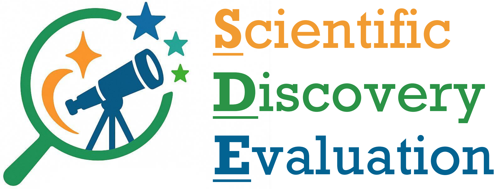

<!-- Logo -->
<p align="center" style="width:60%;margin:0 auto;">
  
</p>

# SDE-Harness (Scientific Discovery Evaluation)

<p align="center">
  <!-- Supported LLMs -->
  
  
  
  <!-- Frameworks -->
  
  
  <!-- License -->
  <a href="https://opensource.org/licenses/MIT"></a>
  <!-- Docs -->
  <a href="https://your-docs-link"></a>
</p>

SDE-Harness (Scientific Discovery Evaluation) is a comprehensive, extensible framework designed to accelerate AI-powered scientific discovery. It supports multi-provider LLMs, iterative and history-aware workflows, and advanced multi-round evaluation, making it ideal for research, benchmarking, and rapid prototyping in scientific domains.

## 🚀 Features

- **Multi-Provider AI Support**: Supports almost all LLMs via [LiteLLM](https://docs.litellm.ai/docs/providers) and also supports running local models from Hugging Face.
- **History-Aware Workflows**: Iterative processes with memory and context from previous iterations
- **Multi-Round Evaluation**: Advanced metrics that analyze trends and improvements across iterations
- **Dynamic Prompts**: Adaptive prompts that evolve based on iteration and historical performance
- **Async Support**: Concurrent batch processing for improved performance
- **Flexible Configuration**: Support for API keys via environment variables or direct parameters

## 📦 Installation

Install the required dependencies:

```bash
pip install -r requirements.txt
```

This only installs the basic dependencies for the framework and some LLM providers. You may need to install additional dependencies for specific LLMs.


## 🔧 Configuration

```bash
cp models.template.yaml models.yaml
cp credentials.template.yaml credentials.yaml
```

Then, edit the `models.yaml` and `credentials.yaml` files to add your LLM info and credentials. Via [LiteLLM](https://docs.litellm.ai/docs/providers), you could use almost all LLMs and providers, such as OpenAI, Google Gemini, Anthropic, Azure OpenAI, Amazon Bedrock, etc. It also supports running local models from Hugging Face.

Additionally, if you want to save the logs of the workflow via [Weave](https://wandb.ai/site/weave/), you should get a Weave API key.


## 🎯 Core Components

### 1. Generation Class - Multi-Provider AI Text Generation

Unified interface for text generation across multiple AI providers.

#### Basic Usage

```python
import weave
from sci_demo.generation import Generation

weave.init("my_research_project")  # the project name in Weave

# Initialize with multiple providers
gen = Generation(
    models_file: str = "models.yaml",
    credentials_file: str = "credentials.yaml",
)

# Generate text with GPT-4o
result = gen.generate(
    prompt="Explain quantum computing in simple terms",
    model_name="openai/gpt-4o-2024-08-06",  # the model name in models.yaml
    # Other optional arguments
    max_tokens=200,
    temperature=0.7
    top_p=0.95,
)

print(f"Response: {result['text']}")
print(f"Provider: {result['provider']}")
print(f"Model: {result['model']}")
print(f"Usage: {"None" if 'usage' not in result else result['usage']}")
```

#### Async Batch Processing

```python
import asyncio

async def batch_example():
    prompts = [
        "What is AI?",
        "Explain neural networks",
        "What is deep learning?"
    ]
    
    results = await gen.generate_batch_async(
        prompts=prompts,
        model_name="openai/gpt-4o-2024-08-06",
        max_tokens=100
    )
    
    for i, result in enumerate(results):
        print(f"Prompt {i+1}: {result['text']}")

asyncio.run(batch_example())
```

### 2. Prompt Class - History-Aware Prompt Management

Enhanced prompt management with history support for iterative workflows.

#### Template Types
- `summarize`: Basic summarization template
- `qa`: Question-answering template
- `translate`: Translation template
- `few_shot`: Few-shot learning template
- `iterative`: Basic iterative template with history context
- `iterative_with_feedback`: Template that includes previous attempts and scores
- `conversation`: Template for conversation-style interactions

#### History Support

```python
from sci_demo.prompt import Prompt

# Create an iterative prompt
prompt = Prompt(
    template_name="iterative_with_feedback",
    default_vars={
        "task_description": "Write a scientific summary",
        "input_text": "Quantum computing applications"
    }
)

# Add history from previous iterations
history = {
    "prompts": ["Previous prompt 1", "Previous prompt 2"],
    "outputs": ["Previous output 1", "Previous output 2"],
    "scores": [{"accuracy": 0.6}, {"accuracy": 0.8}]
}

# Build prompt with history
final_prompt = prompt.build_with_history(history, current_iteration=3)
```

### 3. Oracle Class - Multi-Round Evaluation

Advanced evaluation system supporting both single-round and multi-round metrics.

#### Metric Types
- **Single-Round Metrics**: Traditional metrics that evaluate individual outputs
- **Multi-Round Metrics**: Metrics that analyze patterns across multiple iterations

#### Built-in Multi-Round Metrics
- `improvement_rate`: Rate of improvement across iterations
- `consistency`: Consistency of performance across iterations
- `convergence`: How well outputs are converging to a stable solution

#### Usage

```python
from sci_demo.oracle import Oracle, improvement_rate_metric

oracle = Oracle()

# Register traditional metrics
def accuracy(pred, ref, **kwargs):
    return float(pred.strip().lower() == ref.strip().lower())

oracle.register_metric("accuracy", accuracy)

# Register multi-round metrics
oracle.register_multi_round_metric("improvement_rate", improvement_rate_metric)

# Evaluate with history
scores = oracle.compute_with_history(
    prediction="Current output",
    reference="Expected output",
    history=history_data,
    current_iteration=3
)
```

### 4. Workflow Class - Iterative AI Workflows

Orchestrates multi-stage iterative processes with automatic history integration.

#### Key Features
- **Automatic History Integration**: Prompts automatically receive history context
- **Multi-Round Evaluation**: Uses appropriate metrics based on iteration
- **Trend Analysis**: Analyzes performance trends across iterations
- **Dynamic Stopping Criteria**: Intelligent stopping based on performance metrics

#### Basic Workflow

```python
import weave
from sci_demo.workflow import Workflow

weave.init("my_research_project")  # the project name in Weave

workflow = Workflow(
    generator=gen,
    oracle=oracle,
    max_iterations=5,
    enable_history_in_prompts=True,
    enable_multi_round_metrics=True
)

# Create an iterative prompt
prompt = workflow.create_iterative_prompt(
    task_description="Summarize scientific concepts",
    input_text="Machine learning in healthcare",
    template_type="iterative_with_feedback"
)

# Run workflow
result = workflow.run_sync(
    prompt=prompt,
    reference="Expected summary",
    gen_args={"model": "gpt-4o", "max_tokens": 150},
    history_context={"task_description": "Medical AI summarization"}
)

print(f"Completed {result['total_iterations']} iterations")
print(f"Best iteration: {result['best_iteration']}")
print(f"Final output: {result['history']['outputs'][-1]}")
```

## 🔥 Advanced Features

### Dynamic Prompts with Iteration-Specific Instructions

```python
# Create a dynamic prompt function
dynamic_prompt = workflow.create_dynamic_prompt_function(
    base_task="Explain quantum computing",
    base_input="Quantum mechanics in computation",
    iteration_instructions={
        1: "Provide a basic explanation",
        2: "Add technical details",
        3: "Include real-world applications",
        4: "Ensure accessibility for general audience"
    }
)

result = workflow.run_sync(
    prompt=dynamic_prompt,
    reference="Expected explanation",
    gen_args={"model_name": "openai/gpt-4o-2024-08-06"}
)
```

### Custom Multi-Round Metrics

```python
def diversity_metric(history, reference, current_iteration, **kwargs):
    """Measure diversity of outputs across iterations."""
    if len(history.get("outputs", [])) < 2:
        return 0.0
    
    outputs = history["outputs"]
    total_diversity = 0.0
    total_pairs = 0
    
    for i in range(len(outputs)):
        for j in range(i + 1, len(outputs)):
            words1 = set(outputs[i].lower().split())
            words2 = set(outputs[j].lower().split())
            if len(words1.union(words2)) > 0:
                diversity = 1.0 - len(words1.intersection(words2)) / len(words1.union(words2))
                total_diversity += diversity
                total_pairs += 1
    
    return total_diversity / total_pairs if total_pairs > 0 else 0.0

# Register the custom metric
oracle.register_multi_round_metric("diversity", diversity_metric)
```

### Conversation-Style Workflows

```python
def conversation_prompt_fn(iteration, history):
    if iteration == 1:
        return Prompt(
            template_name="conversation",
            default_vars={"current_message": "Explain photosynthesis"}
        )
    else:
        follow_ups = [
            "Can you simplify that?",
            "What role does chlorophyll play?",
            "How does this relate to climate change?"
        ]
        follow_up = follow_ups[min(iteration-2, len(follow_ups)-1)]
        
        return Prompt(
            template_name="conversation",
            default_vars={"current_message": follow_up}
        )

result = workflow.run_sync(
    prompt=conversation_prompt_fn,
    reference="Expected explanation",
    gen_args={"model": "gpt-4o", "max_tokens": 120}
)
```

### Intelligent Stopping Criteria

```python
def intelligent_stopping_criteria(context):
    scores = context["scores"]
    iteration = context["iteration"]
    
    # Stop if accuracy is high enough
    if scores.get("accuracy", 0) >= 0.9:
        return True
    
    # Stop if improvement rate is very low after iteration 3
    if iteration >= 3 and scores.get("improvement_rate", 0) < 0.01:
        return True
    
    # Stop if convergence is high and consistency is good
    if (scores.get("convergence", 0) >= 0.8 and 
        scores.get("consistency", 0) >= 0.7):
        return True
    
    return False

workflow.stop_criteria = intelligent_stopping_criteria
```

## 📊 Result Analysis

The framework returns comprehensive results with detailed analysis:

```python
result = {
    "history": {
        "prompts": [...],           # All prompts used
        "outputs": [...],           # All generated outputs
        "scores": [...],            # All evaluation scores
        "raw_outputs": [...],       # Full generation responses
        "iterations": [...]         # Iteration numbers
        "generation_metadata": [],  # Track generation details
        "evaluation_metadata": [],  # Track evaluation details
        "timing_info": [],          # Track timing for each iteration
    },
    "total_iterations": 4,          # Number of iterations completed
    "final_scores": {...},          # Final iteration scores
    "best_iteration": {             # Best performing iteration
        "iteration": 3,
        "score": 0.85,
        "output": "..."
    },
    "trend_analysis": {             # Trend analysis for each metric
        "accuracy_trends": {
            "improvement_rate": 0.05,
            "total_improvement": 0.2,
            "consistency": 0.8,
            "best_score": 0.9
        }
    }
}
```

You could also check the logs of the workflow in Weave UI.

## 📚 Examples

### Basic Multi-Provider Usage

```python
from sci_demo.generation import Generation

gen = Generation(
    models_file="models.yaml",
    credentials_file="credentials.yaml"
)

# Test different models
models = ["openai/gpt-4o-2024-08-06", "gemini/gemini-2.5-flash", "anthropic/claude-3-7-sonnet-20250219"]
prompt = "Write a haiku about artificial intelligence"

for model in models:
    result = gen.generate(
        prompt=prompt,
        model_name=model,
        max_tokens=100,
        temperature=0.8
    )
    print(f"\n{model}:")
    print(result['text'])
```

### Complete Iterative Workflow

```python
from sci_demo.generation import Generation
from sci_demo.workflow import Workflow
from sci_demo.oracle import Oracle, improvement_rate_metric

# Setup components
gen = Generation(
    models_file="models.yaml",
    credentials_file="credentials.yaml"
)
oracle = Oracle()

# Register metrics
def accuracy(pred, ref, **kwargs):
    return float(pred.strip().lower() == ref.strip().lower())

def relevance(pred, ref, **kwargs):
    pred_words = set(pred.lower().split())
    ref_words = set(ref.lower().split())
    if not ref_words:
        return 0.0
    return len(pred_words.intersection(ref_words)) / len(ref_words)

oracle.register_metric("accuracy", accuracy)
oracle.register_metric("relevance", relevance)
oracle.register_multi_round_metric("improvement_rate", improvement_rate_metric)

# Create workflow
workflow = Workflow(
    generator=gen,
    oracle=oracle,
    max_iterations=4,
    enable_history_in_prompts=True,
    enable_multi_round_metrics=True
)

# Dynamic prompt with iteration-specific instructions
dynamic_prompt = workflow.create_dynamic_prompt_function(
    base_task="Write a scientific summary",
    base_input="Recent advances in quantum computing",
    iteration_instructions={
        1: "Provide a basic overview",
        2: "Add technical details and examples",
        3: "Include potential applications",
        4: "Ensure clarity and accessibility"
    }
)

# Run workflow
result = workflow.run_sync(
    prompt=dynamic_prompt,
    reference="Quantum computing leverages quantum mechanics for computational advantages",
    gen_args={"model_name": "openai/gpt-4o-2024-08-06", "max_tokens": 150, "temperature": 0.7},
    history_context={"task_description": "Scientific summarization task"}
)

# Analyze results
print(f"Completed {result['total_iterations']} iterations")
print(f"Final scores: {result['final_scores']}")
print(f"Best iteration: {result['best_iteration']['iteration']}")
print(f"Improvement rate: {result['final_scores'].get('improvement_rate', 0):.3f}")
```

## 🛠️ Performance Tips

1. **Enable History Selectively**: Use `enable_history_in_prompts=False` for simple tasks that don't benefit from history

2. **Choose Appropriate Templates**:
   - Use `iterative` for basic iteration
   - Use `iterative_with_feedback` when you want to show scores
   - Use `conversation` for dialogue-style interactions

3. **Model Selection**: Choose the right model for your use case:
   - `gpt-4o`: Best overall performance, multimodal capabilities
   - `gpt-4o-mini`: Faster and cheaper alternative
   - `gemini-1.5-flash`: Fast responses with good quality
   - `claude-3-5-haiku`: Quick responses for simple tasks

4. **Async Processing**: Use async methods for batch processing:
   ```python
   results = await gen.generate_batch_async(prompts, model_name="gpt-4o")
   ```

5. **Memory Management**: For long workflows, consider limiting history size in custom prompt functions

## 📁 Project Structure

```
sci_demo/
├── generation.py          # Multi-provider AI text generation
├── prompt.py             # History-aware prompt management
├── oracle.py             # Multi-round evaluation system
└── workflow.py           # Iterative workflow orchestration

examples/
├── generation_examples.py        # Basic generation examples
└── history_workflow_examples.py  # Advanced workflow examples

requirements.txt          # Project dependencies
README.md                 # This file
```

## 🔍 Troubleshooting

### Common Issues

1. **API Key Not Found**: Ensure environment variables are set or pass keys directly
2. **Model Not Available**: Check if the model name is correct and the provider is configured
3. **Import Errors**: Install optional dependencies for Gemini (`google-generativeai`) or Claude (`anthropic`)
4. **Template Variables Missing**: Ensure all required variables are provided or use default values
5. **Multi-Round Metrics Errors**: Check that history data structure is correct

### Debug Mode

Enable detailed logging:

```python
import logging
logging.basicConfig(level=logging.DEBUG)

# The workflow will now print detailed information about each iteration
```

## 🤝 Contributing

When adding new features:

1. Update prompt templates in `Prompt._load_builtin_templates()`
2. Add new multi-round metrics following the signature: `(history, reference, current_iteration, **kwargs) -> float`
3. Update workflow logic in `Workflow.run()` method
4. Add comprehensive tests and examples
5. Update this documentation

## 📄 License

This project is licensed under the MIT License.
