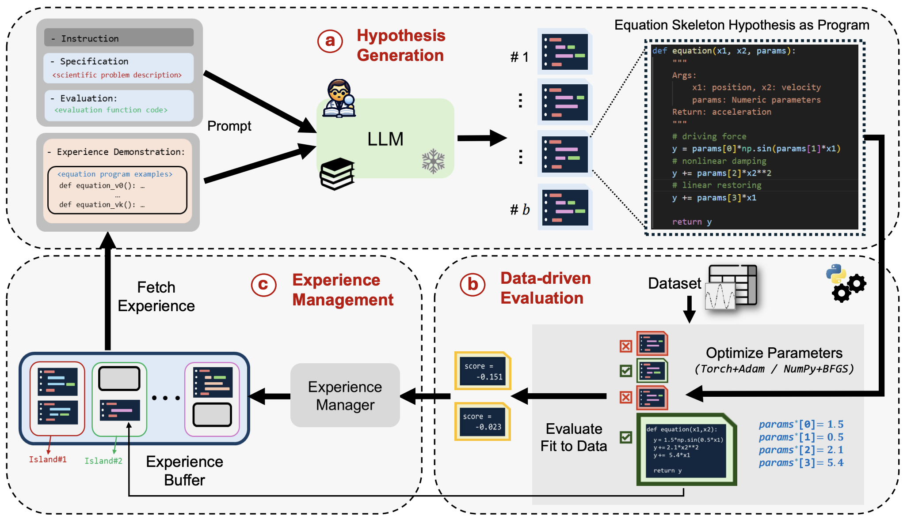

# LLMSR: LLM-based Optimization for Symbolic Regression (Scientific Mathematical Equation Discovery)

<div align="center">



**A scientific discovery framework for automated equation discovery using Large Language Models (LLMs) and multi-island evolutionary optimization.**

[](https://www.python.org/downloads/)
[](https://opensource.org/licenses/MIT)
[](https://github.com/sde-harness)

</div>


## Key Design Elements

- **Multi-Island Evolutionary Design**: Maintains multiple isolated populations (islands) to preserve diversity in optimization 
- **LLM-Driven Generation**: Uses multiple LLM providers to generate and refine mathematical equations
- **Intelligent Sampling**: Implements Boltzmann sampling for balanced exploration vs. exploitation of in-context examples from buffer
- **Adaptive Optimization**: Automatically optimizes equation skeleton parameters using numerical optimization methods (eg. BFGS in scipy)
- **Comprehensive Evaluation**: Multi-metric assessment including NMSE, RMSE, MAE, and convergence analysis

## Structure

```
llmsr/
├── src/                          # Core source code
│   ├── core/                     # Core components and algorithms
│   │   ├── __init__.py          # Core module initialization
│   │   ├── generation.py        # LLMSRGeneration - extends SDE-Harness for equation parsing
│   │   ├── oracle.py            # EquationOracle - fitness evaluation and parameter optimization
│   │   ├── prompt.py            # EvolutionaryPromptTemplates - dynamic prompt generation
│   │   └── buffer.py            # Multi-island evolutionary buffer with Boltzmann sampling
│   ├── modes/                    # Workflow execution modes
│   │   ├── __init__.py          # Modes module initialization
│   │   ├── iter.py              # LLMSRWorkflow - iterative optimization mode
│   │   └── evol.py              # LLMSREvolutionaryWorkflow - multi-island evolutionary mode
│   └── __init__.py              # Main module initialization
├── data/                         # Dataset management and loading
│   └── dataset.py               # LLMSRDatasetLoader - HuggingFace dataset integration
├── cli.py                       # Command-line interface with argument parsing
├── requirements.txt              # Python dependencies
├── models.yaml                   # LLM model configurations
├── credentials.yaml              # API credentials and keys
└── README.md  
```

## Datasets

Framework supports datasets from multiple scientific domains, including the [llm-srbench](https://huggingface.co/datasets/nnheui/llm-srbench) benchmark and others:

### Primary Datasets
- **`lsrtransform`**: Transformed Feynman equations from physics
- **`phys_osc`**: Physical oscillator systems
- **`bio_pop_growth`**: Biological population growth models
- **`chem_react`**: Chemical reaction kinetics
- **`matsci`**: Materials science equations


## Quick Start

### Installation

```bash
# Clone the repository
git clone <repository-url>
cd projects/llmsr

# Install as a package
pip install -e .

# Or install dependencies only
pip install -r requirements.txt
```

### Setup API Credentials

Configure your LLM credentials in the SDE-Harness root directory:

```yaml
# models.yaml
models:
  openai/gpt-4o-2024-08-06:
    provider: openai
    max_tokens: 2000
    temperature: 1.0

# credentials.yaml
credentials:
  openai:
    api_key: your_openai_api_key
```

### Example Runs

```bash
# Evolutionary mode (recommended)
python cli.py --dataset lsrtransform --mode evolutionary --num-islands 10 --max-iterations 1000

# Single problem discovery
python cli.py --dataset bio_pop_growth --problem BPG0 --mode evolutionary

# Custom evolutionary parameters
python cli.py \
  --dataset lsrtransform \
  --mode evolutionary \
  --num-islands 10 \
  --max-programs-per-island 100 \
  --reset-period 200 \
  --sampling-strategy boltzmann
```


## Citation
<pre>
@article{llmsr,
  title={Llm-sr: Scientific equation discovery via programming with large language models},
  author={Shojaee, Parshin and Meidani, Kazem and Gupta, Shashank and Farimani, Amir Barati and Reddy, Chandan K},
  journal={arXiv preprint arXiv:2404.18400},
  year={2024}
}
</pre>

