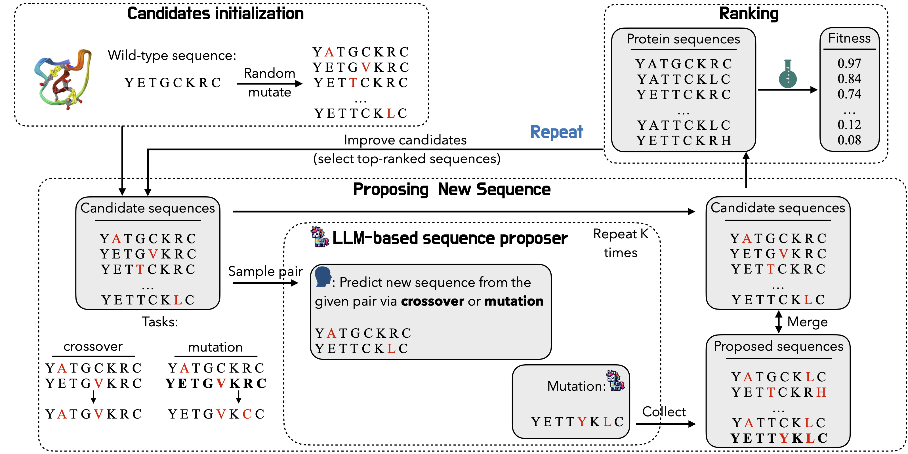

# ProteinOptimizer - LLM-based Protein Sequence Optimization

<p align="center" style="width:90%;margin:0 auto;">
  
</p>

ProteinOptimizer evolves populations of fixed-length protein sequences with a genetic algorithm (GA) whose mutation operator can be delegated to an LLM. It supports single-objective and multi-objective (weighted-sum and Pareto) optimization over five protein fitness landscapes.

## Original Code Repository

This project is a self-contained re-implementation of the relevant parts of the original **LLMProteinOptimizer** paper (LMRL Workshop @ ICLR 2025), refactored to live inside the `sde-harness` codebase.

Paper: [Large Language Model is Secretly a Protein Sequence Optimizer](https://openreview.net/forum?id=mTiXtuIdck) (LMRL Workshop @ ICLR 2025). Preprint: [arXiv:2501.09274](https://arxiv.org/abs/2501.09274)

## 📦 Install

Run these commands from the harness root unless a step says otherwise.

### 1. Enter the ProteinOptimizer project folder

```bash
cd projects/proteinoptimizer
```

### 2. Download required dataset

**No download is required.** All datasets and all model checkpoints are committed to this repository (~32 MB of CSV/NPZ data and ~92 MB of `.ckpt` files), so a plain `git clone` of `sde-harness` already contains everything the five oracles need. There is no Zenodo/Hugging Face step.

Verify the files are present before running anything:

```bash
ls data/GB1/fitness.csv data/TrpB/fitness.csv data/Syn-3bfo/fitness.csv \
   data/Syn-3bfo/3bfo_1_A_model_state_dict.npz \
   data/AAV/ground_truth.csv data/GFP/ground_truth.csv
ls src/utils/ckpt/AAV/mutations_0/percentile_0.0_1.0/cnn_oracle.ckpt \
   src/utils/ckpt/GFP/mutations_0/percentile_0.0_1.0/cnn_oracle.ckpt
```

The five oracles and what each one loads:

| Oracle key  | Dataset                       | Fitness source                                | Reported score                                               |
|:------------|:------------------------------|:----------------------------------------------|:-------------------------------------------------------------|
| `syn-3bfo`  | Synthetic 3bfo landscape      | Potts model (`data/Syn-3bfo/*.npz`)            | Potts energy rescaled by [-3, 3]; unbounded, can be negative |
| `gb1`       | Protein G domain B1           | Experimental CSV (raw fitness ∈ [0, 8.76])     | min–max normalized to [0, 1]                                 |
| `trpb`      | Tryptophan synthase B subunit | Experimental CSV (raw fitness ∈ [0, 1])        | min–max normalized to [0, 1]                                 |
| `aav`       | AAV2 capsid protein           | Pre-trained CNN oracle (`src/utils/ckpt/AAV`)  | min–max normalized to [0, 1]                                 |
| `gfp`       | Green fluorescent protein     | Pre-trained CNN oracle (`src/utils/ckpt/GFP`)  | min–max normalized to [0, 1]                                 |

If `src/utils/ckpt/` is missing (a sparse or partial clone), `aav` and `gfp` cannot run; `syn-3bfo`, `gb1` and `trpb` still work.

### 3. Set up the conda environment

```bash
conda env create -f environment.yml
conda activate ScienceBench_ProteinOptimizer
```

A GPU is optional — the CNN oracles fall back to CPU automatically.

`numpy`, `pandas` and `scipy` are installed **by conda rather than pip on purpose**. Recent numpy wheels are built for `manylinux_2_28`, so on an older system (CentOS 7 / glibc 2.17) pip finds no usable wheel, falls back to the source build, and fails with `NumPy requires GCC >= 9.3`. The conda packages are prebuilt against their own toolchain and sidestep this. `tiktoken` is pinned to `0.9.0` for the same class of reason: newer releases ship no cp310 wheel and need a Rust toolchain to build.

### 4. Configure model files in the harness root

```bash
cd ../..

cat > models.yaml <<'EOF'
openai/gpt-5-mini:
  provider: openai
  model: gpt-5-mini
  credentials: openai

openai/gpt-5:
  provider: openai
  model: gpt-5
  credentials: openai

openai/gpt-5-chat-latest:
  provider: openai
  model: gpt-5-chat-latest
  credentials: openai

anthropic/claude-sonnet-4-5:
  provider: anthropic
  model: claude-sonnet-4-5
  credentials: anthropic

deepseek/deepseek-chat:
  provider: deepseek
  model: deepseek-chat
  credentials: deepseek

deepseek/deepseek-reasoner:
  provider: deepseek
  model: deepseek-reasoner
  credentials: deepseek
EOF

cat > credentials.yaml <<'EOF'
openai:
  api_key: your-openai-key-here
anthropic:
  api_key: your-anthropic-key-here
deepseek:
  api_key: your-deepseek-key-here
EOF

cd projects/proteinoptimizer
```

`models.yaml` and `credentials.yaml` are read from the **harness root**, not from this project folder. The value passed to `--model` must be a key in `models.yaml`. Any provider supported by [LiteLLM](https://docs.litellm.ai/docs/providers) can be added the same way.

### 5. Optional Weave logging

Weave network logging is disabled by default so runs need no Weights & Biases account. Enable it explicitly if you want the traces:

```bash
PROTEINOPT_ENABLE_WEAVE=true python cli.py single --oracle gb1 --generations 1 --model none
```

## 🎯 Usage

### Command Line Interface

ProteinOptimizer provides a command line interface similar to the other harness projects, supporting multiple running modes:

#### Basic Usage

```bash
# Single-objective optimization (used for the paper results)
python cli.py single --oracle gb1

# Multi-objective optimization, weighted sum of fitness and Hamming distance
python cli.py multi --oracle gb1

# Multi-objective optimization with Pareto selection
python cli.py multi-pareto --oracle trpb

# Same GA wrapped in the SDE-Harness Workflow loop
python cli.py workflow --oracle gb1
```

#### Running with Parameters

```bash
# Single-objective, 8 generations, population 200, offspring 100
python cli.py single --oracle aav --generations 8 --population-size 200 --offspring-size 100

# Baseline without any LLM calls (random mutations)
python cli.py single --oracle gb1 --generations 8 --model none

# Weighted-sum multi-objective, maximise fitness and minimise Hamming distance
python cli.py multi --oracle gb1 --generations 10 --fitness-weight 1.0 --hamming-weight -0.2

# Multiple seeds in one command
python cli.py single --oracle gb1 --generations 8 --seed 0 1 2
```

#### View Help

```bash
# View all modes
python cli.py --help

# View help for specific mode
python cli.py single --help
```

### Common Parameters

All modes support the following parameters:

- `--oracle`: Dataset/oracle, one of `syn-3bfo`, `gb1`, `trpb`, `aav`, `gfp` (default: `syn-3bfo`)
- `--model`: Model name from the harness root `models.yaml` (default: `openai/gpt-5-mini`). Use `none` for the random-mutation baseline
- `--population-size`: Population kept each generation (default: 10)
- `--offspring-size`: Offspring produced per generation (default: 20)
- `--generations`: Number of GA generations (default: 3)
- `--initial-size`: Number of starting sequences (default: 20)
- `--mutation-rate`: Per-position mutation probability (default: 0.01)
- `--seed`: Random seed(s), space-separated for multiple runs (default: 0)
- `--output-dir`: Directory for result JSON files (default: `results`)
- `--resume-results` / `--continue-generations`: Continue from a previous run's JSON

`multi` additionally supports `--fitness-weight` (default: 0.5) and `--hamming-weight` (default: -0.5).

### Verified Smoke Test

After completing the setup above, run a minimal one-generation check that needs no API key:

```bash
python cli.py single \
  --oracle gb1 \
  --generations 1 \
  --population-size 8 \
  --offspring-size 8 \
  --initial-size 8 \
  --model none \
  --output-dir results_smoke
```

The command should load the GB1 landscape, run one GA generation, print the best sequence and score, and write `results_smoke/results_single_gb1_0_baseline.json`. Using `--output-dir results_smoke` keeps the committed reference runs in `results/` intact.

Then confirm the LLM path works end-to-end with one small API-backed run:

```bash
python cli.py single \
  --oracle gb1 \
  --generations 1 \
  --population-size 8 \
  --offspring-size 8 \
  --initial-size 8 \
  --model deepseek/deepseek-chat \
  --output-dir results_smoke
```

The final lines report how many mutations actually came from the LLM:

```text
LLM-guided mutations: 8/8 succeeded, 0 fell back to random mutation.
```

If every mutation reports `fell back to random mutation`, the run is the random baseline under the model's name. A bad API key, a model key missing from `models.yaml`, or a model that refuses the prompt all cause this; the first failure prints a `[WARN] LLM call to … failed (…)` line with the underlying error. Fix it before launching a full sweep.

### Output

Each `single` / `multi` run writes `results/results_{single|multi}_<oracle>_<seed>_<model>.json`, where `<model>` is the part of `--model` after the `/` (e.g. `gpt-5-mini`), or `baseline` for `--model none`:

```jsonc
{
  "best_sequence": "…",               // best sequence found
  "best_score": 0.87,                 // its oracle score
  "best_scores_history": [...],       // best score after each generation
  "best_sequences_history": [...],    // the corresponding sequence per generation
  "final_population": [["SEQ", 0.87], ...],
  "oracle_calls": 1234,
  "llm_mutations": 800,               // mutations actually produced by the LLM
  "llm_fallbacks": 0,                 // mutations that fell back to random (both 0 for `--model none`)
  "all_results": {"SEQ": 0.87, ...}   // every sequence ever scored; dominates the file size
}
```

`multi-pareto` and `workflow` print their results to stdout and do not write a JSON file.

Summarize a results folder into one Top-1 / Top-5 / Top-10 table:

```bash
python src/analyze.py --glob "./results/results_single_*.json" --higher-is-better 1
```

Use the `results_single_*` glob, not `./results/*.json`: the folder also contains multi-objective runs on a different scale, and including them changes every number (Baseline Top-1 becomes 0.4927 instead of 0.7514). Note also that `analyze.py` collapses model names into families — anything starting with `deepseek` is averaged into a single `DeepSeek` row, and unrecognised names are dropped as `Other`.

Generate the figures:

```bash
python src/plot.py --input_dir ./results --out_dir ./figures
```

This writes `ProteinOptimizerResult`, `PO_top1_convergence` and `PO_top1_by_task_grouped` as PNG and PDF. It only reads files named `results_single_<task>_0_<model>.json` (seed 0).

## 🏗️ Project Structure

```
projects/proteinoptimizer/
├── cli.py                      # Command line entry point
├── run_all.sh                  # Full paper sweep
├── environment.yml             # Environment configuration
├── requirements.txt            # pip fallback
├── src/                        # Source code directory
│   ├── modes/                  # Running mode modules
│   │   ├── single_objective.py       # Single-objective mode
│   │   ├── multi_objective_protein.py# Weighted-sum multi-objective mode
│   │   └── multi_pareto_protein.py   # Pareto multi-objective mode
│   ├── core/
│   │   ├── protein_optimizer.py      # GA + LLM-guided mutation
│   │   ├── pareto_optimizer.py       # Pareto GA
│   │   ├── pareto.py, multiobjective.py
│   ├── oracles/
│   │   ├── fitness_oracles.py        # GB1 / TrpB / Syn-3bfo (CSV + Potts)
│   │   ├── ml_oracles.py             # AAV / GFP (CNN checkpoints)
│   │   ├── multi_objective_oracles.py# Hamming-distance objective
│   │   └── base.py
│   ├── utils/
│   │   ├── potts_model.py, predictors.py, tokenize.py, evolutionary_ops.py
│   │   └── ckpt/                     # AAV & GFP CNN checkpoints (shipped)
│   ├── generation.py           # LLM wrapper around sde_harness Generation
│   ├── workflow.py             # SDE-Harness Workflow integration
│   ├── weave_utils.py          # Weave logging helpers
│   ├── analyze.py              # Result summary table
│   └── plot.py                 # Figures
├── data/                       # Data files (shipped)
├── results/                    # Result JSONs
├── figures/                    # Generated figures
└── README.md                   # This document
```

## 🐛 Troubleshooting

### Common Issues

1. **`models.yaml` / `credentials.yaml` Not Found**

   Both files are read from the harness root, not from this folder.
   ```bash
   ls ../../models.yaml ../../credentials.yaml
   ```

2. **API Key Error / All Models Score Like the Baseline**

   Check that the `credentials:` tag in `models.yaml` matches a block in `credentials.yaml`. The GA catches generation errors and falls back to random mutation, so a bad key shows up as baseline-like scores rather than a crash. Check the `LLM-guided mutations:` line at the end of the run.

3. **Missing Data Files**

   ```bash
   # Check the data and checkpoint files exist
   ls data/GB1/fitness.csv data/Syn-3bfo/3bfo_1_A_model_state_dict.npz
   ls src/utils/ckpt/AAV/mutations_0/percentile_0.0_1.0/cnn_oracle.ckpt
   ```
   Nothing is downloaded at install time; if these are missing, the clone is incomplete.

4. **Weave Login / Logging Issues**

   Weave is disabled by default (`WEAVE_DISABLED=true`) so local checks need no Weights & Biases account. If you enabled it and have no account:
   ```bash
   unset PROTEINOPT_ENABLE_WEAVE
   ```

5. **`ModuleNotFoundError: No module named 'src'`**

   Run `cli.py` from inside `projects/proteinoptimizer/`; the CLI resolves `src.*` relative to the current directory.

6. **`analyze.py` Prints an Unaligned Table**

   Install `tabulate` (`pip install tabulate`); without it the script falls back to plain text.

7. **Environment Issues**

   ```bash
   # Recreate environment
   conda env remove -n ScienceBench_ProteinOptimizer
   conda env create -f environment.yml
   conda activate ScienceBench_ProteinOptimizer
   ```
   The classic conda solver can take several minutes on this file; that is normal. To speed it up, `conda install -n base conda-libmamba-solver` and add `--solver=libmamba`. If you change the `tiktoken` pin and see `Failed building wheel for tiktoken`, put it back.

8. **Model Returns Nothing / Refuses the Prompt**

   Some models decline the protein-engineering prompt and return `finish_reason: refusal` with empty content (observed on `anthropic/claude-sonnet-4-5` in August 2026); reasoning models may spend the whole budget on reasoning tokens. Either way the run silently reproduces the random baseline, so check `llm_fallbacks` in the result JSON. Sanity-check one call first:
   ```bash
   cd ../..
   python -c "
   from sde_harness.core import Generation
   g = Generation(models_file='models.yaml', credentials_file='credentials.yaml')
   r = g.generate(prompt='Reply with the word OK', model_name='<your-model-key>', max_tokens=20)
   print(r['finish_reason'], repr(r['text']))"
   cd projects/proteinoptimizer
   ```

9. **CUDA Warnings / No GPU**

   The pip `torch` wheel may be built against a newer CUDA than the local driver, so PyTorch falls back to CPU and everything still runs. To force CPU explicitly:
   ```bash
   CUDA_VISIBLE_DEVICES= python cli.py single --oracle aav --model none
   ```

## 📚 Examples

### Quick Start

```bash
# 1. Set up environment
conda activate ScienceBench_ProteinOptimizer
cd projects/proteinoptimizer

# 2. Run the API-free baseline
python cli.py single --oracle gb1 --generations 8 --population-size 200 --offspring-size 100 --model none

# 3. Try an LLM-guided run
python cli.py single --oracle gb1 --generations 8 --population-size 200 --offspring-size 100 --model deepseek/deepseek-chat
```

### Advanced Usage

Reproduce the full paper sweep — every model on every dataset, then the table and figures:

```bash
# Runs `single` for each model x dataset at --generations 8 --population-size 200
# --offspring-size 100 --seed 0. Edit the model/dataset/seed lists at the top of the
# script as needed. Results land in results/, logs in logs/.
bash run_all.sh

python src/analyze.py --glob "./results/results_single_*.json" --higher-is-better 1
python src/plot.py --input_dir ./results --out_dir ./figures
```

Each generation issues one LLM call per offspring attempt (up to `2 × offspring_size` attempts, retried up to 5 times if the model returns no valid sequence), so one LLM-backed (model, dataset) run makes roughly 800–1600 API calls. Baseline runs make none and finish in about a minute per dataset. `run_all.sh` starts every job in the background, so reduce the lists if a provider rate-limits you.

Reference numbers for that sweep, averaged over the five datasets:

| Model             |   Top_1 |   Top_5 |   Top_10 |
|:------------------|--------:|--------:|---------:|
| Baseline          |  0.7514 |  0.6899 |   0.6564 |
| GPT5-mini         |  0.7867 |  0.7262 |   0.6821 |
| DeepSeek          |  0.8713 |  0.8022 |   0.7649 |
| Claude-Sonnet-4-5 |  0.7759 |  0.6967 |   0.6427 |
| GPT-5             |  0.8561 |  0.8129 |   0.7842 |
| GPT-5-chat-latest |  0.8582 |  0.7896 |   0.7438 |

`Baseline` is `--model none`. Re-running `run_all.sh` overwrites the committed JSONs in `results/`, so copy the folder first if you want to keep them. LLM runs are not bit-reproducible (provider-side sampling), so expect small deviations even at a fixed `--seed`.

To extend the project to a new dataset: drop `data/<DatasetName>/fitness.csv` (and an optional Potts `*.npz`) into `data/`, add an oracle class in `src/oracles/` mirroring `FitnessOracle` (CSV landscapes) or `AAVOracle` (ML checkpoints), export it from `src/oracles/__init__.py`, then add the tag to `oracle_choices` in `cli.py` and to the oracle dispatch in `src/modes/`.

## 📄 License

This refactor inherits the original Apache 2.0 license for the Potts model code and follows the MIT license of SDE-Harness. See the root `LICENSE` file.

## 🔗 Related Links

- Paper (LMRL Workshop @ ICLR 2025): [https://openreview.net/forum?id=mTiXtuIdck](https://openreview.net/forum?id=mTiXtuIdck)
- Preprint: [https://arxiv.org/abs/2501.09274](https://arxiv.org/abs/2501.09274)
- SDE-Harness framework: [https://github.com/HowieHwong/sde-harness](https://github.com/HowieHwong/sde-harness)
- Provider and model configuration: [LiteLLM providers](https://docs.litellm.ai/docs/providers)

## 📖 Citation

If you find this work useful, please cite our paper:

```bibtex
@inproceedings{wang2025large,
  title={Large Language Model is Secretly a Protein Sequence Optimizer},
  author={Wang, Yinkai and He, Jiaxing and Du, Yuanqi and Chen, Xiaohui and Li, Jianan Canal and Liu, Liping and Xu, Xiaolin and Hassoun, Soha},
  booktitle={Learning Meaningful Representations of Life (LMRL) Workshop at ICLR 2025},
  year={2025},
  url={https://openreview.net/forum?id=mTiXtuIdck}
}
```
