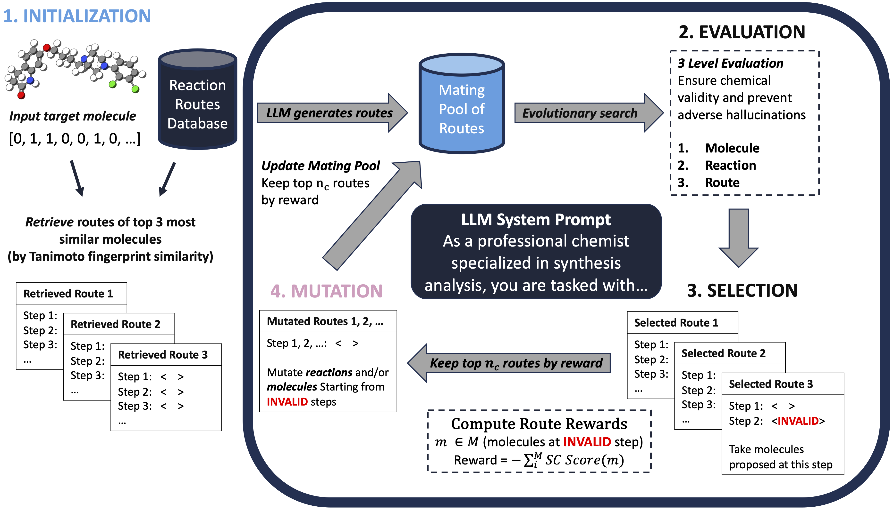

# LLM-Syn-Planner - LLM-based Retrosynthesis Pathway Design




Original Code Repository
------------------------
[https://github.com/zoom-wang112358/LLM-Syn-Planner](https://github.com/zoom-wang112358/LLM-Syn-Planner)


Differences to Original Code
----------------------------
* The original code supports running retrosynthesis on fixed targets from benchmarks (e.g., `Pistachio Hard`). Here, the code has been modified to take as input a target SMILES or a file containing multiple SMILES to run retrosynthesis

* The code has been refactored to remove unused dependencies and files

* The code also requires use of the [Synthetic Complexity Score (SCScore)](https://github.com/connorcoley/scscore) - following the original code, this repository is directly included in `./src` but unused data and model checkpoints have been removed

* In the future, some dependencies will be removed (e.g., `Syntheseus` retrosynthesis framework)


Installation
-------------
1. Setup conda environment:
   ```bash
   source env_setup.sh
   ```

2. Set Your API KEY:
   ```bash
   export OPENAI_API_KEY="your-api-key-here"
   ```

3. Download required data (copied the link from the original repository), unzip, and add it to the repository:
   #### NOTE: Not all downloaded files are used, as this repository is a modified version of the original code

   https://www.dropbox.com/scl/fi/dmmypid2ooohp3freiox8/dataset.zip?rlkey=fmrhvds6fmxck2cp8h94albpc&e=1&st=8fmtxls4&dl=0

   #### From sde-harness/projects/synplanner directory, run
   ```bash
   curl -L https://github.com/connorcoley/scscore/raw/master/data/data_processed.csv -o dataset/data_processed.csv
   ```


Command Line Interface Usage
----------------------------
**NOTE 1:** Default hyperparameters can be found here: `./src/hparams_default.yaml`

**NOTE 2:** On first run, computed fingerprints will be saved in `./dataset`. Subsequent runs will load them.

```bash
# Single target molecule (aripiprazole)
python cli.py --target_smiles "C1CC(=O)NC2=C1C=CC(=C2)OCCCCN3CCN(CC3)C4=C(C(=CC=C4)Cl)Cl"

# Single or multiple molecules from an input file
# The provided `test_smiles.smi` contains aripiprazole and osimertinib but more SMILES could be added
# The code will parse through the SMILES and sequentally run search on each
python cli.py --target_smiles test_smiles.smi

# LLM temperature impacts performance. Default is 0.7 and this parameter is exposed to the user
python cli.py --target_smiles test_smiles.smi --temperature 0.5
```

References
----------
* [Original Code Repository](https://github.com/zoom-wang112358/LLM-Syn-Planner)

* [Publication](https://openreview.net/forum?id=NhkNX8jYld&noteId=9wCQSd8Tfu)
    