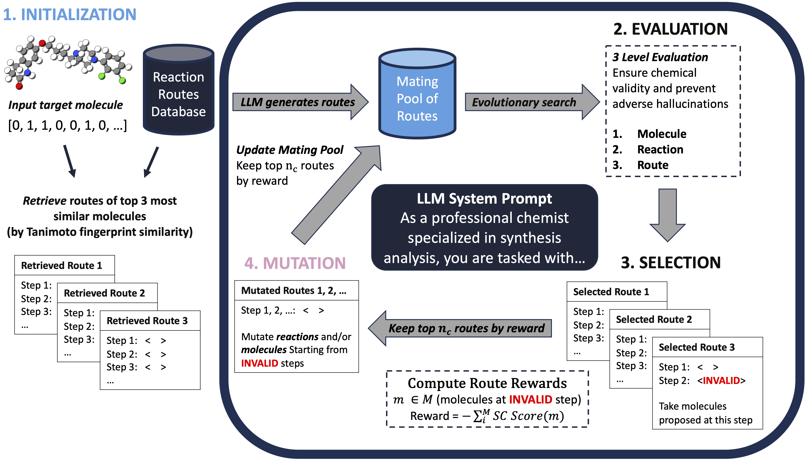

# LLM-Syn-Planner - LLM-based Retrosynthesis Pathway Design




Original Code Repository
------------------------
[https://github.com/zoom-wang112358/LLM-Syn-Planner](https://github.com/zoom-wang112358/LLM-Syn-Planner)


Differences to Original Code
----------------------------
* The code has been refactored

* [LiteLLM](https://docs.litellm.ai/) used in place of the [OpenAI API](https://platform.openai.com/docs/overview) as the entry point to various LLMs

* The code also requires use of the [Synthetic Complexity Score (SCScore)](https://github.com/connorcoley/scscore) - following the original code, this repository is directly included in `./src` but unused data and model checkpoints have been removed

* In the future, some dependencies will be removed (e.g., `Syntheseus` retrosynthesis framework)

* **Stopping Criterion:** The algorithm now terminates based on the number of LLM calls (`max_oracle_calls`) rather than the number of unique routes scored


Installation
-------------
1. Setup conda environment:
   ```bash
   source env_setup.sh
   ```

2. Set Your API KEY (not all keys have to be set, just the ones you want to use):
   ```bash
   export OPENAI_API_KEY="your-api-key-here"
   export ANTHROPIC_API_KEY="your-api-key-here"
   export XAI_API_KEY="your-api-key-here"
   ```

3. Download required data (copied the link from the original repository), unzip, and add it to the repository:

   ```bash
   curl -L "https://www.dropbox.com/scl/fi/dmmypid2ooohp3freiox8/dataset.zip?rlkey=fmrhvds6fmxck2cp8h94albpc&e=1&st=8fmtxls4&dl=1" --output dataset.zip
   unzip dataset.zip
   rm dataset.zip
   ```

   #### From sde-harness/projects/synplanner directory, run
   ```bash
   curl -L https://github.com/connorcoley/scscore/raw/master/data/data_processed.csv -o dataset/data_processed.csv
   ```


Command Line Interface Usage
----------------------------
**NOTE 1:** Default hyperparameters can be found here: `./src/hparams_default.yaml`

**NOTE 2:** On first run, computed fingerprints will be saved in `./dataset`. Subsequent runs will load them.

**NOTE 3:** The `--max_oracle_calls` parameter controls the maximum number of LLM calls before termination. This directly impacts API costs and runtime. Default values used in benchmarks are 100, 300, and 500.

```bash
# Single target molecule (aripiprazole)
python cli.py --target_smiles "C1CC(=O)NC2=C1C=CC(=C2)OCCCCN3CCN(CC3)C4=C(C(=CC=C4)Cl)Cl"

# Single or multiple molecules from an input file
# The provided `test_smiles.smi` contains aripiprazole and osimertinib but more SMILES could be added
# The code will parse through the SMILES and sequentally run search on each
python cli.py --target_smiles test_smiles.smi

# LLM temperature impacts performance. Default is 0.7 and this parameter is exposed to the user
python cli.py --target_smiles test_smiles.smi --temperature 0.5

# Control the maximum number of LLM calls (affects cost and runtime)
python cli.py --target_smiles test_smiles.smi --max_oracle_calls 300

# Running on pre-defined targets 
# Choose from {"uspto-easy", "uspto-190", "pistachio-reachable", "pistachio-hard"}
python cli.py --dataset uspto-easy
```

Benchmark on Pre-defined Target Sets
------------------------------------
### 5. Script
```bash
sh run_benchmark.sh
```
This script runs a sweep of the following:
   - **model** = ("gpt-4o", "gpt-5" "gpt-5-chat-latest", "claude-sonnet-4-5" "deepseek-reasoner")
   - **datase**t = {""pistachio-hard"}
   - **max_oracle_calls** = {100}

*Modify the script to run more/less configurations.*

### 6. Results Table
```bash
python create_benchmark_table.py
```
# TODO: show example table


References
----------
* [Original Code Repository](https://github.com/zoom-wang112358/LLM-Syn-Planner)

* [Publication](https://openreview.net/forum?id=NhkNX8jYld&noteId=9wCQSd8Tfu)
    