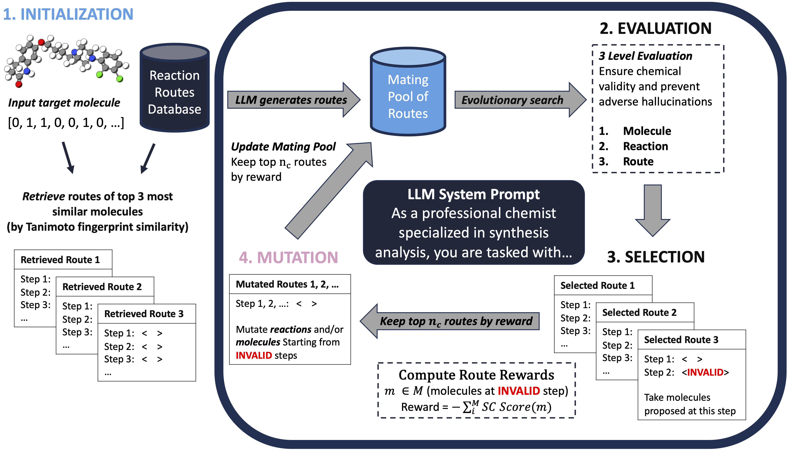

# LLM-Syn-Planner - LLM-based Retrosynthesis Pathway Design



## Original Code Repository

[https://github.com/zoom-wang112358/LLM-Syn-Planner](https://github.com/zoom-wang112358/LLM-Syn-Planner)

### Differences to Original Code

* The code has been refactored

* [LiteLLM](https://docs.litellm.ai/) used in place of the [OpenAI API](https://platform.openai.com/docs/overview) as the entry point to various LLMs

* The code also requires use of the [Synthetic Complexity Score (SCScore)](https://github.com/connorcoley/scscore) - following the original code, this repository is directly included in `./src` but unused data and model checkpoints have been removed

* In the future, some dependencies will be removed (e.g., `Syntheseus` retrosynthesis framework)

* **Stopping Criterion:** The algorithm now terminates based on the number of LLM calls (`max_oracle_calls`) rather than the number of unique routes scored

## 📦 Install

Run these commands from the harness root.

### 1. Enter the Synplanner project folder

```bash
cd projects/synplanner
```

### 2. Download required data

Download required data (copied the link from the original repository), unzip, and add it to the repository:

```bash
curl -L "https://www.dropbox.com/scl/fi/dmmypid2ooohp3freiox8/dataset.zip?rlkey=fmrhvds6fmxck2cp8h94albpc&e=1&st=8fmtxls4&dl=1" --output dataset.zip
unzip dataset.zip
rm dataset.zip
```

From sde-harness/projects/synplanner directory, run

```bash
mkdir -p dataset
curl -L https://github.com/connorcoley/scscore/raw/master/data/data_processed.csv -o dataset/data_processed.csv
```

Both downloads are required. The SCScore checkpoint and SAScore data are included in `src/` in this repo and do not require separate model downloads.

### 3. Setup conda environment

The existing setup script uses Linux/CUDA packages.

If you do not have Conda installed:

Install Miniconda following the [official Conda installation guide](https://docs.conda.io/projects/conda/en/stable/user-guide/install/) for your operating system.


Return to `projects/synplanner` and run:

```bash
source env_setup.sh
```

### 4. Set Your API KEY

Set Your API KEY (not all keys have to be set, just the ones you want to use):

```bash
export OPENAI_API_KEY="your-api-key-here"
export ANTHROPIC_API_KEY="your-api-key-here"
export DEEPSEEK_API_KEY="your-api-key-here"
```

## 🎯 Usage

### Command Line Interface

**NOTE 1:** Default hyperparameters can be found here: `./src/hparams_default.yaml`

**NOTE 2:** On first run, computed fingerprints will be saved in `./dataset`. Subsequent runs will load them.

**NOTE 3:** The `--max_oracle_calls` parameter controls the maximum number of LLM calls before termination. This directly impacts API costs and runtime. The default value used in the benchmark is 100.

#### Basic Usage

```bash
# Single target molecule (aripiprazole)
python cli.py --target_smiles "C1CC(=O)NC2=C1C=CC(=C2)OCCCCN3CCN(CC3)C4=C(C(=CC=C4)Cl)Cl" --model gpt-4o --temperature 0.7

# Single or multiple molecules from an input file
# The provided `test_smiles.smi` contains aripiprazole and osimertinib but more SMILES could be added
# The code will parse through the SMILES and sequentally run search on each
python cli.py --target_smiles test_smiles.smi --model gpt-4o --temperature 0.7

# Running on pre-defined targets
# Choose from {"uspto-easy", "uspto-190", "pistachio-reachable", "pistachio-hard"}
python cli.py --dataset pistachio-hard --model gpt-4o --temperature 0.7
```

#### Running with Parameters

```bash
# LLM temperature impacts performance. Default is 0.7 (if model allows) and this parameter is exposed to the user
python cli.py --target_smiles test_smiles.smi --temperature 0.5 --model gpt-4o

# Control the maximum number of LLM calls (affects cost and runtime)
python cli.py --target_smiles test_smiles.smi --max_oracle_calls 300 --model gpt-4o --temperature 0.7
```

#### View Help

```bash
python cli.py --help
```

### Common Parameters

- `--target_smiles`: A SMILES string or a file containing one SMILES per line.
- `--dataset`: One of `uspto-easy`, `uspto-190`, `pistachio-reachable`, or `pistachio-hard`.
- `--model`: LLM model name (default: `gpt-5`).
- `--temperature`: Temperature parameter (default: `0.7`, GPT-5 models require `1.0`).
- `--max_oracle_calls`: LLM-call stopping budget (default: `100`).
- `--seed`: Random seed(s) (default: `0`).
- `--output_dir`: Results directory (default: `./synplanner_results`).

Specify the model and temperature explicitly, as above: the CLI's default model requires a temperature of `1.0`.

### Output

Logs and route results are saved under `synplanner_results/<model>/<dataset>/<max_oracle_calls>/`. Single-target and input-file runs omit the dataset directory. Solved routes are saved in the `solved_routes/` subdirectory.

## 🏗️ Project Structure

```text
projects/synplanner/
├── cli.py                      # Command line entry point
├── env_setup.sh                # Environment setup
├── dataset/                    # Downloaded data and fingerprint caches
├── src/                        # Source code and scoring models
│   └── hparams_default.yaml    # Default hyperparameters
├── assets/                     # Overview figure
├── test_smiles.smi             # Example target molecules
├── run_benchmark.sh            # Benchmark script
├── create_benchmark_table.py   # Results table generation
├── synplanner_results.tar.gz   # Publication results
└── README.md
```

## 🐛 Troubleshooting

### Common Issues

1. **API Key Error**: Set the API key for the selected model as shown in Install step 4.
2. **Missing Data Files**: Complete both downloads in Install step 2 and run from `projects/synplanner`.
3. **Temperature Error**: Use `--temperature 1.0` with GPT-5 models.

## 📚 Examples

### Benchmark on Pre-defined Target Sets

#### Script

```bash
python create_benchmark_table.py --results_dir ./synplanner_results_fresh
```

The script runs a sweep of the following:

- **model** = {"gpt-4o", "gpt-5", "gpt-5-chat-latest", "claude-sonnet-4-5", "deepseek-reasoner"}
- **dataset** = {"pistachio-hard"}
- **max_oracle_calls** = {100}

*Modify the script to run more/less configurations.*

#### Results Table

```bash
python create_benchmark_table.py --results_dir ./synplanner_results_fresh
```

To generate the table from the archived results:

```bash
mkdir archived_results
tar -xzf synplanner_results.tar.gz -C archived_results
python create_benchmark_table.py --results_dir ./archived_results/synplanner_results
```

**NOTE:** `./synplanner_results.tar.gz` contains a compressed copy (for space reasons) of the results from a single run of all the models below (these values are in the publication).

| Algorithm | Pistachio-Hard |
|-----------|----------------|
| LLM-Syn-Planner(gpt-4o) | 60.0 |
| LLM-Syn-Planner(gpt-5-chat-latest) | 49.0 |
| LLM-Syn-Planner(gpt-5) | 53.0 |
| LLM-Syn-Planner(claude-sonnet-4-5) | 53.0 |
| LLM-Syn-Planner(deepseek-reasoner) | 42.0 |

## 📄 License

See the harness [MIT License](../../LICENSE) and the bundled [SCScore license](src/scscore/LICENSE).

## 🔗 Related Links

* [Original Code Repository](https://github.com/zoom-wang112358/LLM-Syn-Planner)

* [Publication](https://openreview.net/forum?id=NhkNX8jYld&noteId=9wCQSd8Tfu)