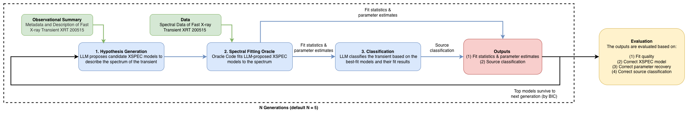

# X-Ray Spectral Fitting Benchmark

An LLM-driven evolutionary algorithm for automated X-ray spectral model discovery, source classification, and physical parameter recovery. Part of the [SDE-Harness](../../README.md) framework.

## Overview

X-ray spectral analysis — selecting the right physical model, fitting it to photon-counting data, and interpreting the result — is a core task in observational astrophysics. This benchmark tests whether large language models can perform that task end-to-end: proposing XSPEC models, evaluating them against real spectral data, and classifying the astrophysical source from the fit results.

The benchmark scores the LLM on four axes: fit quality, model selection, parameter recovery, and astrophysical source classification.

## Workflow

The benchmark runs an evolutionary loop between an LLM hypothesis generator and a Sherpa spectral fitting oracle:

1. **Hypothesis Generation** — The LLM receives an observational summary of X-ray transient [XRT 200515](https://doi.org/10.1093/mnras/stae2808) and the spectral data, and proposes 4 candidate XSPEC model strings.
2. **Spectral Fitting Oracle** — Each candidate is fitted to the PHA spectrum using Sherpa's Levenberg-Marquardt optimiser with the C-statistic. The oracle returns fit statistics (C-stat, BIC) and best-fit parameter values.
3. **Classification** — After each generation, the LLM classifies the astrophysical source based on the current best-fit model and fit results, choosing from a fixed list of 22 source classes.
4. **Selection & Iteration** — The top 2 models by BIC survive to the next generation. The LLM sees these surviving models and their fit results when proposing the next round of hypotheses. Steps 1–3 repeat for *N* generations (default: 5).



## Project Structure

```
xray-spectral-fitting/
├── cli.py                              # CLI entry point
├── setup_env.sh                        # Conda environment setup
├── data/
│   └── spectra/
│       └── lmc_flare/                  # LMC X-ray transient
│           ├── flaresp_grp1.pha        # Grouped PHA spectrum
│           ├── flaresp.rmf             # Response matrix
│           ├── flaresp.corr.arf        # Auxiliary response
│           ├── flaresp_bkg.pi          # Background spectrum
│           └── metadata.json           # Ground truth + scoring config
├── src/
│   ├── compat.py                       # LiteLLM wrapper (multi-provider)
│   ├── evaluator.py                    # Scoring and evaluation
│   └── core/
│       ├── optimizer.py                # Evolutionary loop
│       ├── prompts.py                  # LLM prompt templates
│       └── oracle/
│           └── sherpa_oracle.py        # Sherpa/XSPEC fitting backend
```

## Scoring Criteria

<!-- TODO: Add scoring criteria figure -->

Each run is evaluated on **4 criteria** (0 or 1 point each, max score = 4):

| # | Criterion | Pass condition |
|---|-----------|----------------|
| 1 | **Good fit** | \|reduced C-stat - 1\| ≤ 0.05 |
| 2 | **Correct model** | Best-fit model matches `tbabs * bbody`, allowing equivalent parameterisations (`xsbbody` ≡ `xsbbodyrad`, `xstbabs` ≡ `xsphabs`) |
| 3 | **Parameter recovery** | kT ∈ [1.80, 1.90] keV for thermal models, or Γ ∈ [0.4, 0.6] for non-thermal models |
| 4 | **Source classification** | Correctly selects *Thermonuclear X-ray burst* from 22 source classes |

Criteria 1-3 test statistical and spectral analysis skill. Criterion 4 tests astrophysical reasoning — whether the LLM can connect a fitted model to its physical origin.

## Results

Benchmark results on the LMC X-ray transient spectrum (5 generations, 4 offspring per generation, population size 2):

### Summary

| Model | Score | Reduced C-stat | Correct model | kT / Γ | Classification |
|-------|:-----:|:--------------:|:-------------:|:------:|:--------------:|
| GPT-5 | **3**/4 | 0.959 ✅ | `tbabs * bbodyrad` ✅ | kT = 1.849 keV ✅ | Magnetar flare ❌ |
| DeepSeek-R1 | **3**/4 | 0.959 ✅ | `tbabs * bbody` ✅ | kT = 1.850 keV ✅ | Magnetar giant flare ❌ |
| GPT-5-chat | 2/4 | 0.983 ✅ | `tbabs * powerlaw` ❌ | Γ = 0.500 ✅ | Magnetar giant flare ❌ |
| Claude Sonnet 4.5 | 2/4 | 0.982 ✅ | `tbabs * powerlaw` ❌ | Γ = 0.502 ✅ | Stellar coronal flare ❌ |
| GPT-4o | 1/4 | 0.967 ✅ | `tbabs * nthcomp` ❌ | Γ = 1.012 ❌ | Magnetar flare ❌ |

*Ground truth: absorbed blackbody (`xstbabs * xsbbody`), kT ≈ 1.85 keV, thermonuclear X-ray burst.*

### BIC Convergence (best BIC within each generation)

| Model | Gen 1 | Gen 2 | Gen 3 | Gen 4 | Gen 5 |
|-------|:-----:|:-----:|:-----:|:-----:|:-----:|
| GPT-5 | **147.2** | 151.7 | 154.3 | 154.4 | 154.5 |
| DeepSeek-R1 | **147.2** | 151.7 | 156.3 | 157.2 | 155.4 |
| GPT-5-chat | 150.5 | 151.7 | 155.8 | 156.4 | 154.3 |
| Claude Sonnet 4.5 | 150.4 | 152.1 | 165.1 | 165.3 | 154.4 |
| GPT-4o | 157.9 | 152.2 | 176.2 | 163.4 | 156.8 |

### Key Findings

- **GPT-5 and DeepSeek-R1** find the correct blackbody model in generation 1 (BIC = 147.2) and score 3/4.
- **GPT-5-chat and Claude Sonnet 4.5** converge to power-law models that fit well statistically (reduced C-stat < 1.0) but are physically incorrect for this source.
- **GPT-4o** is the weakest, converging to Comptonization (`nthcomp`) with 5 failed fit attempts across the run.
- **Source classification is 0/5 across all models.** Even models that correctly fit a soft ~1.85 keV blackbody fail to identify it as a thermonuclear X-ray burst, defaulting to magnetar variants instead. This reveals a disconnect between statistical fitting ability and astrophysical reasoning.

## Installation

### Prerequisites

- Python 3.8 with Sherpa + XSPEC support
- Conda (recommended)
- API key(s) for your chosen LLM provider(s)

### Option 1: Setup script (recommended)

The setup script handles platform detection and sets up a working conda environment:

```bash
./setup_env.sh
conda activate xray-spectral-fitting
```

### Option 2: Manual

```bash
conda create -n xray-spectral-fitting python=3.8 -y
conda activate xray-spectral-fitting

conda install -c conda-forge -c ciao sherpa -y
pip install litellm pyyaml
```

### Verify

```bash
python -c "from sherpa.astro import ui; ui.set_xsxsect('vern'); print('Sherpa+XSPEC OK')"
```

### API Keys

API credentials are managed at the repository level in `config/credentials.yaml`:

```bash
cp ../../config/credentials.template.yaml ../../config/credentials.yaml
# Fill in your API keys (OpenAI, Anthropic, DeepSeek, etc.)
```

## Usage

```bash
# Basic run with verbose output
python cli.py fit --pha data/spectra/lmc_flare/flaresp_grp1.pha -v

# Specify model, generations, and output file
python cli.py fit \
    --pha data/spectra/lmc_flare/flaresp_grp1.pha \
    --model openai/gpt-5 \
    --generations 5 \
    -o results.json -v
```

### CLI Options

| Option | Default | Description |
|--------|---------|-------------|
| `--pha` | *(required)* | Path to PHA spectrum file |
| `--model` | `openai/gpt-4o-2024-08-06` | LLM model key (from `config/models.yaml`) |
| `--generations` | 5 | Number of evolutionary generations |
| `--population-size` | 2 | Models kept per generation |
| `--offspring-size` | 4 | Hypotheses proposed per generation |
| `--seed` | 0 | Random seed for reproducibility |
| `-o` | — | Output JSON file path |
| `-v` | — | Verbose output |

### Supported Models

Configured in `config/models.yaml`:

| Model key | Provider |
|-----------|----------|
| `openai/gpt-5` | OpenAI |
| `openai/gpt-5-chat` | OpenAI |
| `openai/gpt-4o-2024-08-06` | OpenAI |
| `deepseek/deepseek-R1` | DeepSeek |
| `anthropic/claude-sonnet-4.5` | Anthropic |

## Output

Each run produces three files:

| File | Contents |
|------|----------|
| `results.json` | Full structured output: all fit results, scoring metrics, classification log, generation-by-generation history |
| `results_generations.csv` | One row per model per generation — suitable for convergence plots |
| `results_summary.txt` | Human-readable PASS/FAIL summary |

### Example Output

```
=== Generation 3 ===
Generated 4 hypotheses
  xstbabs.abs1 * xsbbody.bb1: C-stat=130.35/136=0.958  BIC=147.2
    Reasoning: A simple absorbed blackbody to test whether the emission is thermal...
  xstbabs.abs1 * xspowerlaw.pl1: C-stat=132.84/134=0.991  BIC=150.4
    Reasoning: A power-law model to explore non-thermal emission...
  ...

All tried models (12 total, ranked by BIC):
  1. xstbabs.abs1 * xsbbody.bb1     rcstat=0.958  BIC=147.2
  2. xstbabs.abs1 * xspowerlaw.pl1  rcstat=0.991  BIC=150.4
  ...

Classification: Magnetar giant flare
```

## Scientific Background

### The LMC Flare Dataset

The included spectrum is from [XRT 200515](https://doi.org/10.1093/mnras/stae2808), a fast extragalactic X-ray transient discovered in the Large Magellanic Cloud by *Chandra*. The ground truth best-fit model is an absorbed blackbody (`xstbabs * xsbbody`) with kT ≈ 1.85 keV, consistent with a **thermonuclear X-ray burst** (Type I burst) from an accreting neutron star. The low absorption column (nH ~ 0.01 × 10²² cm⁻²) is expected given the LMC's modest foreground gas along this line of sight.

### C-Statistic and BIC

The **C-statistic** (Cash 1979) is a Poisson likelihood ratio used for low-count X-ray data. A reduced C-stat (C-stat / degrees of freedom) near 1.0 indicates a good fit. The **Bayesian Information Criterion** (BIC = C-stat + k ln n) penalises model complexity, favouring simpler models when fit quality is comparable. Both are standard tools in X-ray spectral analysis.

### Common XSPEC Models

| Model | Type | Physical interpretation |
|-------|------|------------------------|
| `xstbabs` | Absorption | Interstellar absorption (Tuebingen-Boulder ISM model) |
| `xsbbody` / `xsbbodyrad` | Thermal | Blackbody emission (neutron star surface, burst photosphere) |
| `xspowerlaw` | Non-thermal | Featureless power law (synchrotron, inverse Compton) |
| `xsbremss` | Thermal | Free-free emission from hot ionised gas |
| `xsapec` | Thermal | Collisionally-ionised optically-thin plasma |
| `xsdiskbb` | Thermal | Multi-temperature accretion disk (Shakura-Sunyaev) |
| `xscomptt` / `xsnthcomp` | Comptonization | Thermal/non-thermal Comptonization of seed photons |

## Citation

This benchmark task is sourced from the following research paper:

```bibtex
@article{Dillmann2025,
    author = {Dillmann, Steven and Martínez-Galarza, Juan Rafael and Soria, Roberto and Stefano, Rosanne Di and Kashyap, Vinay L},
    title = {Representation learning for time-domain high-energy astrophysics: Discovery of extragalactic fast X-ray transient XRT 200515},
    journal = {Monthly Notices of the Royal Astronomical Society},
    publisher = {Oxford University Press (OUP)},
    year = 2025,
    month = feb,
    volume = {537},
    number = {2},
    pages = {931-955},
    issn = {0035-8711},
    doi = {10.1093/mnras/stae2808},
    url = {https://doi.org/10.1093/mnras/stae2808},
}
```

## Troubleshooting

### Apple Silicon (M1/M2/M3/M4)

Sherpa/XSPEC may require an `osx-64` (x86_64) conda environment on Apple Silicon. If the setup script or the generic manual steps don't work, try:

```bash
CONDA_SUBDIR=osx-64 conda create -n xray-spectral-fitting python=3.8 -y
conda activate xray-spectral-fitting
conda config --env --set subdir osx-64
conda install -c conda-forge -c ciao sherpa -y
pip install litellm pyyaml
```
