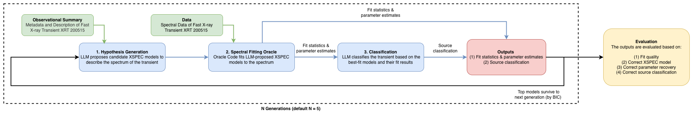

# X-Ray Spectral Fitting - LLM-driven X-ray Spectral Model Discovery

An LLM-driven evolutionary algorithm for automated X-ray spectral model discovery, source classification, and physical parameter recovery. The LLM proposes XSPEC model expressions, a Sherpa oracle fits each one to a real *Chandra* spectrum, the best models by BIC survive to the next generation, and after every generation the LLM classifies the astrophysical source. Runs are scored on four criteria (fit quality, model selection, parameter recovery, source classification).



## Original Code Repository

This benchmark was developed directly inside `sde-harness`; there is no separate upstream repository. The spectrum and the ground truth come from the discovery paper of the fast X-ray transient XRT 200515:

Paper: [Representation learning for time-domain high-energy astrophysics: Discovery of extragalactic fast X-ray transient XRT 200515](https://doi.org/10.1093/mnras/stae2808) (Dillmann et al. 2025, MNRAS 537, 931) · [arXiv:2412.01150](https://arxiv.org/abs/2412.01150)

## 📦 Install

Run these commands from the harness root unless a step says otherwise.

### 1. Enter the X-Ray Spectral Fitting project folder

```bash
cd projects/xray-spectral-fitting
```

### 2. Download required dataset

**No download is required.** The *Chandra* ACIS-S spectrum of XRT 200515 (ObsID 23022) and all response files are committed to this repository (~16 MB under `data/spectra/lmc_flare/`), so a plain `git clone` of `sde-harness` already contains everything. There is no Zenodo / Hugging Face step and no model checkpoint to fetch.

Verify the files the benchmark actually reads are present:

```bash
ls data/spectra/lmc_flare/flaresp_grp1.pha data/spectra/lmc_flare/flaresp.rmf \
   data/spectra/lmc_flare/flaresp.corr.arf data/spectra/lmc_flare/flaresp_bkg.pi \
   data/spectra/lmc_flare/metadata.json
```

| File | Role |
| --- | --- |
| `flaresp_grp1.pha` | Grouped source spectrum passed to `--pha`. Its header points Sherpa at the three files below, so they must stay in the same directory. |
| `flaresp.rmf` | Redistribution matrix (`RESPFILE`) |
| `flaresp.corr.arf` | Ancillary response (`ANCRFILE`) |
| `flaresp_bkg.pi` | Background spectrum (`BACKFILE`) |
| `metadata.json` | Observation summary shown to the LLM **and** the ground truth used for scoring (expected model, kT, classification) |

The remaining files in that folder (`*evt2*.fits`, `*_r0122_*.fits.gz`, `flaresp.pha`, `flaresp.arf`) are the ungrouped / upstream *Chandra* products kept for provenance; nothing reads them.

### 3. Set up the conda environment

```bash
conda env create -f environment.yml
conda activate ScienceBench_XraySpectralFitting
```

The environment is Python 3.12 with Sherpa 4.18.0 from the **Chandra X-ray Center (CXC) conda channel**, `numpy`, `astropy` and `pyyaml` from conda-forge, and `litellm` from pip. Three pins are load-bearing:

| Pin | Why |
| --- | --- |
| channel `https://cxc.cfa.harvard.edu/conda/ciao` | Only the CXC channel ships Sherpa **with the XSPEC model library** (`xstbabs`, `xsbbody`, `xspowerlaw`, ...). The conda-forge `sherpa` package has no XSPEC models, and the `ciao` channel on anaconda.org is empty, so `conda install -c ciao sherpa` silently gives you a Sherpa that cannot evaluate any model this benchmark proposes. |
| `sherpa=4.18.0` / `python=3.12` | The CXC channel builds its recent Sherpa releases for a single Python version each (4.18.0 → 3.12, 4.17.0 → 3.11). Changing one pin without the other makes the solve fail. |
| `numpy>=2.3.5,<2.5` | CIAO 4.18's `pycrates`, Sherpa's default FITS reader, still uses `numpy.chararray`, which numpy 2.5 removed. With an unpinned numpy the solver picks 2.5.x and every fit fails with `No usable I/O backend was imported`. `astropy` is installed as well: it is Sherpa's alternative FITS backend and the oracle switches to it automatically if `pycrates` cannot be imported. |

Expect a ~1.7 GB download (the XSPEC model data alone is 1.5 GB) and several minutes of solving. Supported platforms are **linux-64, osx-64 and osx-arm64** — Apple Silicon Macs get native arm64 builds, no Rosetta environment is needed. There are no linux-aarch64 builds (e.g. AWS Graviton); use an x86_64 machine or `docker run --platform linux/amd64` there. No GPU is used.

`./setup_env.sh` is a thin wrapper around the same `conda env create` for people who prefer a script. If you already have a working Sherpa+XSPEC environment, `pip install -r requirements.txt` adds the two pip dependencies to it.

Confirm that Sherpa can see the XSPEC models before going further (this is the step that fails when the wrong channel was used):

```bash
python -c "from sherpa.astro import ui; ui.set_xsxsect('vern'); print('Sherpa+XSPEC OK')"
```

Expected: a line `Cross Section Table set to vern: ...` followed by `Sherpa+XSPEC OK`. One warning on import is harmless and appears in every command below: `imaging routines will not be available ... Could not find ds9` (no DS9 viewer installed). If instead you see `Cannot import usable I/O backend`, see Troubleshooting 2.

### 4. Configure model files in the harness root

`models.yaml` and `credentials.yaml` are read from the **harness root**, not from this project folder. The example below declares the five models used for the reference results; keep only the ones you have keys for, or add any other [LiteLLM-supported](https://docs.litellm.ai/docs/providers) model the same way.

```bash
cd ../..

cat > models.yaml <<'EOF'
openai/gpt-4o-2024-08-06:
  provider: openai
  model: gpt-4o-2024-08-06
  credentials: openai

openai/gpt-5-chat:
  provider: openai
  model: gpt-5-chat-latest
  credentials: openai

openai/gpt-5:
  provider: openai
  model: gpt-5
  credentials: openai
  reasoning: true

deepseek/deepseek-R1:
  provider: deepseek
  model: deepseek-reasoner
  credentials: deepseek
  reasoning: true

anthropic/claude-sonnet-4.5:
  provider: anthropic
  model: claude-sonnet-4-5-20250929
  credentials: anthropic
EOF

cat > credentials.yaml <<'EOF'
openai:
  api_key: ${OPENAI_API_KEY}
deepseek:
  api_key: ${DEEPSEEK_API_KEY}
anthropic:
  api_key: ${ANTHROPIC_API_KEY}
EOF

export OPENAI_API_KEY="your-api-key-here"
cd projects/xray-spectral-fitting
```

- The value passed to `--model` must be a key in `models.yaml` (the part before the colon; the name itself is free-form).
- `${VAR}` placeholders are resolved from the environment at call time. Only the variables of the credential blocks you actually use must be set — a run with `--model openai/gpt-5` never looks at the `deepseek` block.
- **`reasoning: true`** marks reasoning models (GPT-5, o-series, DeepSeek-R1, ...). For those the run drops `temperature` and raises the completion budget to 16 000 tokens; without the flag the model may spend the whole 2 000-token budget on hidden reasoning and return empty text, which shows up as `Generated 0 hypotheses`.
- For backwards compatibility the project also accepts `config/models.yaml` / `config/credentials.yaml` (a `config/` folder in the harness root) if the root files do not exist.

### 5. Optional: check one LLM call in isolation

Before spending a full run, confirm the model key, credentials and provider talk to each other:

```bash
cd ../..
python -c "
import sys; sys.path.insert(0, 'projects/xray-spectral-fitting')
from src.compat import Generation
g = Generation(models_file='models.yaml', credentials_file='credentials.yaml')
r = g.generate(prompt='Reply with the word OK', model_name='openai/gpt-4o-2024-08-06', max_tokens=20)
print(r['finish_reason'], repr(r['text']))"
cd projects/xray-spectral-fitting
```

Expected: `stop 'OK'` (or `'OK.'`). Weave/W&B logging is not used by this project, so no Weights & Biases account or login is needed.

## 🎯 Usage

### Command Line Interface

The CLI has two subcommands: `list` (find spectra, needs nothing but the data files) and `fit` (run the benchmark).

#### Basic Usage

```bash
# List the spectra shipped with the project
python cli.py list

# Run the benchmark with the default model (openai/gpt-4o-2024-08-06), verbose
python cli.py fit --pha data/spectra/lmc_flare/flaresp_grp1.pha -v

# Same run, saving results.json / results_generations.csv / results_summary.txt
python cli.py fit --pha data/spectra/lmc_flare/flaresp_grp1.pha -v -o results/gpt-4o.json
```

#### Running with Parameters

```bash
# GPT-5 (needs `reasoning: true` in models.yaml, see Install step 4)
python cli.py fit --pha data/spectra/lmc_flare/flaresp_grp1.pha \
  --model openai/gpt-5 --generations 5 -v -o results/gpt-5.json

# Larger search: 6 hypotheses per generation, keep the best 3, 8 generations
python cli.py fit --pha data/spectra/lmc_flare/flaresp_grp1.pha \
  --model anthropic/claude-sonnet-4.5 \
  --offspring-size 6 --population-size 3 --generations 8 -o results/claude.json

# Three repeats in one command (writes results/gpt-5_seed0.json, _seed1, _seed2)
python cli.py fit --pha data/spectra/lmc_flare/flaresp_grp1.pha \
  --model openai/gpt-5 --seed 0 1 2 -o results/gpt-5.json
```

#### View Help

```bash
# View all subcommands
python cli.py --help

# View help for the fit subcommand
python cli.py fit --help
```

### Common Parameters

`fit` accepts the following parameters:

- `--pha`: Path to the grouped PHA spectrum (required; use `data/spectra/lmc_flare/flaresp_grp1.pha`). `metadata.json` is looked up in the same directory; without it the run still fits but is not scored.
- `--model`: Model name from the harness root `models.yaml` (default: `openai/gpt-4o-2024-08-06`)
- `--generations`: Number of evolutionary generations (default: 5)
- `--population-size`: Models kept between generations, ranked by BIC (default: 2)
- `--offspring-size`: Hypotheses the LLM proposes per generation (default: 4)
- `--seed`: One or more integers; the whole run is repeated once per value (default: 0). The LLM is sampled at temperature 1.0 and the Sherpa fit is deterministic, so the seed only labels the repeat — it does not make an LLM run reproducible.
- `--emin` / `--emax`: Energy band in keV recorded in the observation summary (defaults 0.3 / 7.0). The Sherpa filter itself is fixed to the same 0.3–7 keV band in `src/oracle/sherpa_oracle.py`.
- `-o`, `--output`: Output JSON path. Parent directories are created; with several seeds `_seed<N>` is appended to the file name.
- `-v`, `--verbose`: Print every hypothesis, fit result and the final PASS/FAIL table. Without it only a one-line score is printed.

Each generation costs **2 LLM calls** (one for the hypotheses, one for the classification) and up to `--offspring-size` Sherpa fits of about a second each, so a default run makes 10 LLM calls and 20 fits. With `openai/gpt-4o-2024-08-06` a default run took 46 s wall-clock; reasoning models are slower.

### Verified Smoke Test

After completing the setup above, first run the oracle alone — no API key is needed, and the numbers are deterministic. Run it **from `projects/xray-spectral-fitting`**:

```bash
python -c "
from src.oracle import SherpaOracle
o = SherpaOracle('data/spectra/lmc_flare/flaresp_grp1.pha')
r = o.fit_model('xstbabs.abs1 * xsbbody.bb1')
print('success', r['success'])
print('C-stat', r['cstat'], 'dof', r['dof'], 'reduced', r['reduced_cstat'], 'BIC', r['bic'])
print('params', r['params'])"
```

Expected output (Sherpa and XSPEC print their own fit log and a `tbvabs` banner around these lines; the banner can even appear after them because it is flushed at exit):

```text
success True
C-stat 132.38 dof 138 reduced 0.9592 BIC 147.22
params {'abs1.nH': 0.0, 'bb1.kT': 1.849833, 'bb1.norm': 0.000129}
```

These numbers were produced with Sherpa 4.18.0 / XSPEC 12.14.0k from a clean `conda env create` on macOS arm64 and are deterministic. This is the ground-truth model of the benchmark: any LLM run that proposes an absorbed blackbody lands on exactly these values (compare the Results table, BIC 147.2). If this prints `success False` with `No usable I/O backend was imported`, see Troubleshooting 2; with an error naming `xstbabs`, Sherpa was installed without XSPEC — go back to Install step 3.

Then check the LLM path end to end with a minimal one-generation run (this one spends tokens: 2 LLM calls):

```bash
python cli.py fit --pha data/spectra/lmc_flare/flaresp_grp1.pha \
  --model openai/gpt-4o-2024-08-06 --generations 1 --offspring-size 2 -v -o results/smoke.json
```

It takes about 10 s and should print one `--- Generation 1 ---` block with two fitted hypotheses, a `Classification:` line, the `FINAL BENCHMARK RESULTS` table ending in `SCORE: n/4 criteria met`, and then:

```text
Saved to results/smoke.json
Saved to results/smoke_generations.csv
Saved to results/smoke_summary.txt
```

The score of this tiny run depends on what the model proposes first (0/4 and 3/4 were both observed with gpt-4o) and is not a pass/fail signal for the setup. `FAILED - ...` lines for individual hypotheses are also normal: an invalid XSPEC expression is reported back to the LLM as feedback in the next generation. The run itself only fails if it stops with a traceback. Without `-v` the same command prints only the `Saved to` lines and one summary line:

```text
Best model: xstbabs.abs1 * xsbbody.bbody1  |  SCORE: 3/4 criteria met (PARTIAL)
```

### Output

Every run prints per-generation progress. With `-v` each hypothesis is shown with its fit statistics and reasoning, followed by the ranking of all models tried and the final table:

```text
--- Generation 1 ---
Generated 4 hypotheses
  xstbabs.abs1 * xspowerlaw.pow1: C-stat=135.55/138=0.982  BIC=150.4
    Reasoning: A power-law model is a simple choice to account for non-thermal processes...
  xstbabs.abs1 * xsblackbody.bb1: FAILED - invalid model expression: name 'xsblackbody' is no
  xstbabs.abs1 * xsapec.apec1: C-stat=152.43/138=1.105  BIC=167.3
  xstbabs.abs1 * xscomptt.comp1: C-stat=132.29/136=0.973  BIC=157.0

All tried models (4 total, ranked by BIC):
  1. xstbabs.abs1 * xspowerlaw.pow1  reduced_cstat=0.982  BIC=150.4
  2. xstbabs.abs1 * xscomptt.comp1  reduced_cstat=0.973  BIC=157.0
  ...
  Classification: Magnetar giant flare
...
==================================================
FINAL BENCHMARK RESULTS
==================================================
  Best model: xstbabs.abs1 * xspowerlaw.pow1
  Fitted Gamma: 0.511

  [PASS] Good fit (|reduced_cstat - 1| <= 0.05): rcstat=0.982, BIC=150.4
  [FAIL] Correct model expression: xstbabs.abs1 * xspowerlaw.pow1
  [PASS] Correct Gamma (0.4-0.6): 0.511
  [FAIL] Correct source classification: Magnetar flare / Soft Gamma Repeater (SGR) outburst
--------------------------------------------------
  SCORE: 2/4 criteria met
  STATUS: PARTIAL SUCCESS
==================================================
```

(Real output of a default `openai/gpt-4o-2024-08-06` run on 2026-09-05, Sherpa 4.18.0.) Sherpa's own fit log (`Method = levmar`, parameter tables, `WARNING: unable to read ARF (background)`, `WARNING: data set 1 has associated backgrounds, but they have not been subtracted`) is interleaved with these lines; all of it is normal.

With `-o results/<name>.json` three files are written next to each other:

| File | Contents |
| --- | --- |
| `<name>.json` | `results` (best model, per-generation `generations_log`, `classification_log`, every fit in `all_results`, `oracle_calls`), `metrics` (the four criteria, `final_score`, `final_status`, `kt_value` / `gamma_value`, `llm_classification`), plus the `ground_truth` and `metadata` used |
| `<name>_generations.csv` | One row per hypothesis per generation: `generation, model, reduced_cstat, bic, success, cstat, dof, n_free_params` — the input for convergence tables like the one below |
| `<name>_summary.txt` | The human-readable PASS/FAIL table above |

`results*` files are git-ignored (`results/` is not created until you pass `-o`). If the LLM ever returns text that cannot be parsed into hypotheses, the raw response is dumped to `last_llm_response_debug.txt` in the current directory (also git-ignored).

## 🏗️ Project Structure

```
projects/xray-spectral-fitting/
├── cli.py                      # Command line entry point (`list`, `fit`) and scoring/report code
├── environment.yml             # Conda environment (CXC channel Sherpa + XSPEC, litellm, pyyaml)
├── requirements.txt            # pip part only, for an existing Sherpa+XSPEC environment
├── setup_env.sh                # Wrapper around `conda env create -f environment.yml`
├── sdexrayfinal.drawio.png     # Workflow figure
├── data/
│   └── spectra/
│       └── lmc_flare/          # Chandra ObsID 23022, XRT 200515 (shipped, ~16 MB)
│           ├── flaresp_grp1.pha    # Grouped spectrum (input)
│           ├── flaresp.rmf         # Response matrix
│           ├── flaresp.corr.arf    # Auxiliary response
│           ├── flaresp_bkg.pi      # Background spectrum
│           └── metadata.json       # Observation summary + ground truth
├── src/
│   ├── compat.py               # Loads sde_harness Oracle/Prompt/EvaluatorBase; LiteLLM Generation wrapper
│   ├── evaluator.py            # Model-equivalence check and parameter comparison
│   ├── core/
│   │   ├── optimizer.py        # Evolutionary loop (propose → fit → rank by BIC → classify)
│   │   └── prompts.py          # Prompt templates incl. the 22 source classes
│   └── oracle/
│       └── sherpa_oracle.py    # Sherpa/XSPEC fitting backend (C-stat, Levenberg-Marquardt, BIC)
├── results/                    # Run output when you pass -o (git-ignored)
└── README.md                   # This document
```

The project uses `sde_harness.core.Oracle`, `Prompt` and `EvaluatorBase` directly from the harness sources. LLM calls go through the small LiteLLM wrapper in `src/compat.py` rather than `sde_harness.core.Generation`, so the harness-root `requirements.txt` (torch, transformers, weave, ...) is **not** needed for this project.

## 🧪 Scoring Criteria

Each run is evaluated on **4 criteria** (0 or 1 point each, max score = 4). The ground truth lives in `data/spectra/lmc_flare/metadata.json`.

| # | Criterion | Pass condition |
| --- | --- | --- |
| 1 | **Good fit** | \|reduced C-stat − 1\| ≤ 0.05 for the best model (lowest BIC) |
| 2 | **Correct model** | Best model has the same components as `xstbabs * xsbbody`, allowing equivalent parameterisations (`xsbbodyrad` ≡ `xsbbody`; `xsphabs`, `xswabs` ≡ `xstbabs`) |
| 3 | **Parameter recovery** | kT ∈ [1.80, 1.90] keV for thermal models, or Γ ∈ [0.4, 0.6] for power-law models |
| 4 | **Source classification** | The final-generation classification is exactly *Thermonuclear X-ray burst* (one of 22 classes listed in `src/core/prompts.py`) |

Criteria 1–3 test statistical and spectral-analysis skill; criterion 4 tests astrophysical reasoning — whether the LLM connects a fitted ~1.85 keV blackbody with no persistent counterpart to its physical origin. Candidates are ranked by BIC = C-stat + k·ln(n), so a more complex model only wins if it improves the fit enough to pay for its extra parameters. The LLM never sees `ground_truth`, `phenomenology` or the `spectral_evolution` entry of `metadata.json`.

## 📊 Results

Reference results on the XRT 200515 spectrum with the default settings (5 generations, 4 offspring per generation, population size 2, one run per model):

| Model | Score | Reduced C-stat | Correct model | kT / Γ | Classification |
| --- | :---: | :---: | :---: | :---: | :---: |
| GPT-5 | **3**/4 | 0.959 ✅ | `tbabs * bbodyrad` ✅ | kT = 1.849 keV ✅ | Magnetar flare ❌ |
| DeepSeek-R1 | **3**/4 | 0.959 ✅ | `tbabs * bbody` ✅ | kT = 1.850 keV ✅ | Magnetar giant flare ❌ |
| GPT-5-chat | 2/4 | 0.983 ✅ | `tbabs * powerlaw` ❌ | Γ = 0.500 ✅ | Magnetar giant flare ❌ |
| Claude Sonnet 4.5 | 2/4 | 0.982 ✅ | `tbabs * powerlaw` ❌ | Γ = 0.502 ✅ | Stellar coronal flare ❌ |
| GPT-4o | 1/4 | 0.967 ✅ | `tbabs * nthcomp` ❌ | Γ = 1.012 ❌ | Magnetar flare ❌ |

*Ground truth: absorbed blackbody (`xstbabs * xsbbody`), kT ≈ 1.85 keV, thermonuclear X-ray burst.*

Best BIC within each generation (from `*_generations.csv`):

| Model | Gen 1 | Gen 2 | Gen 3 | Gen 4 | Gen 5 |
| --- | :---: | :---: | :---: | :---: | :---: |
| GPT-5 | **147.2** | 151.7 | 154.3 | 154.4 | 154.5 |
| DeepSeek-R1 | **147.2** | 151.7 | 156.3 | 157.2 | 155.4 |
| GPT-5-chat | 150.5 | 151.7 | 155.8 | 156.4 | 154.3 |
| Claude Sonnet 4.5 | 150.4 | 152.1 | 165.1 | 165.3 | 154.4 |
| GPT-4o | 157.9 | 152.2 | 176.2 | 163.4 | 156.8 |

Key findings:

- **GPT-5 and DeepSeek-R1** find the correct blackbody model in generation 1 (BIC = 147.2) and score 3/4.
- **GPT-5-chat and Claude Sonnet 4.5** converge to power-law models that fit well statistically (reduced C-stat < 1.0) but are physically incorrect for this source.
- **GPT-4o** is the weakest, converging to Comptonization (`nthcomp`) with 5 failed fit attempts across the run.
- **Source classification is 0/5 across all models.** Even models that correctly fit a soft ~1.85 keV blackbody fail to identify it as a thermonuclear X-ray burst, defaulting to magnetar variants instead — a disconnect between statistical fitting ability and astrophysical reasoning.

LLM runs are not deterministic (sampling at temperature 1.0), so a re-run reproduces the *pattern* — which model family is found, whether kT lands in the window — rather than these exact BIC trajectories. The Sherpa numbers for a given model expression are exact and reproducible within a Sherpa version. The table above was produced with an older Sherpa (blackbody: C-stat 130.35 / 136 dof); Sherpa 4.18.0 groups the spectrum into two more bins (C-stat 132.38 / 138 dof) but yields the same reduced C-stat (0.959), BIC (147.2), kT (1.850 keV) and Γ (0.51) to the quoted precision, so scores are directly comparable.

A fresh default run of `openai/gpt-4o-2024-08-06` with this README's environment (2026-09-05) scored 2/4: best model `xstbabs * xspowerlaw` (reduced C-stat 0.982, Γ = 0.511, BIC 150.4), classification *Magnetar flare / SGR outburst*. That is one point better than the table entry above and illustrates the run-to-run spread.

### Scientific background

The spectrum is from [XRT 200515](https://doi.org/10.1093/mnras/stae2808), a fast extragalactic X-ray transient discovered in the Large Magellanic Cloud by *Chandra*. The ground-truth best-fit model is an absorbed blackbody (`xstbabs * xsbbody`) with kT ≈ 1.85 keV, consistent with a **thermonuclear (Type I) X-ray burst** from an accreting neutron star; the low absorption column (nH ~ 0.01 × 10²² cm⁻²) matches the modest foreground gas towards the LMC. Fits use the **C-statistic** (Cash 1979), the Poisson likelihood statistic for low-count data (a reduced C-stat near 1 indicates a good fit), and are ranked by **BIC**, which penalises free parameters.

| XSPEC model | Type | Physical interpretation |
| --- | --- | --- |
| `xstbabs` | Absorption | Interstellar absorption (Tuebingen-Boulder ISM model) |
| `xsbbody` / `xsbbodyrad` | Thermal | Blackbody emission (neutron star surface, burst photosphere) |
| `xspowerlaw` | Non-thermal | Featureless power law (synchrotron, inverse Compton) |
| `xsbremss` | Thermal | Free-free emission from hot ionised gas |
| `xsapec` | Thermal | Collisionally-ionised optically-thin plasma |
| `xsdiskbb` | Thermal | Multi-temperature accretion disk (Shakura-Sunyaev) |
| `xscomptt` / `xsnthcomp` | Comptonization | Thermal/non-thermal Comptonization of seed photons |

## 🐛 Troubleshooting

### Common Issues

1. **Sherpa imports but XSPEC models are missing** (the Install step 3 check fails, or every hypothesis fails with an error naming `xstbabs` / `xsbbody`)

   Sherpa came from conda-forge (or from the empty `ciao` channel on anaconda.org) instead of the CXC channel. Check and recreate:
   ```bash
   conda list -n ScienceBench_XraySpectralFitting "sherpa|xspec"   # both should list the cxc.cfa.harvard.edu channel
   conda env remove -n ScienceBench_XraySpectralFitting
   conda env create -f environment.yml
   ```

2. **`No usable I/O backend was imported` on every fit, or `Cannot import usable I/O backend` on import**

   Sherpa's FITS reader (`pycrates`) failed to import, almost always because numpy ≥ 2.5 got into the environment (`python -c "import pycrates"` then shows `cannot import name 'chararray' from 'numpy'`). Either pin numpy back or make sure astropy is present — the oracle falls back to Sherpa's astropy backend automatically:
   ```bash
   conda install -n ScienceBench_XraySpectralFitting -c conda-forge "numpy<2.5" astropy
   ```

3. **`Models configuration file not found: .../models.yaml`**

   Both files are read from the harness root, not from this folder. Re-run Install step 4.
   ```bash
   ls ../../models.yaml ../../credentials.yaml
   ```

4. **`Environment variable OPENAI_API_KEY is not set`**

   `credentials.yaml` uses `${VAR}` placeholders; export the variable in the shell that runs `cli.py`, or paste the key directly into `credentials.yaml` (it is git-ignored).
   ```bash
   export OPENAI_API_KEY="your-actual-key"
   ```

5. **`Model 'xyz' not found in models_file`**

   `--model` must match a top-level key of `models.yaml` exactly, e.g. `openai/gpt-5`, not the provider's model id.

6. **`Generated 0 hypotheses` every generation / empty responses**

   Almost always a reasoning model without `reasoning: true` in `models.yaml` — it spends the 2 000-token budget on hidden reasoning and returns no text. Add the flag (Install step 4). The raw response is saved to `last_llm_response_debug.txt` for inspection. If the model answered but not in JSON, that file shows what it wrote instead.

7. **`FAILED - ...` lines for individual hypotheses**

   Normal. Typical causes are an XSPEC component that does not exist (`xsblackbody`, `xsbb`, `xsbremsstrahlung` — the real names are `xsbbody`, `xsbremss`), an expression without instance names (`xstbabs*xsbbody` instead of `xstbabs.abs1 * xsbbody.bb1`) or a parameter name that does not belong to the model. The error text is fed back to the LLM in the next generation. Only a Python traceback that stops the run is a real failure.

8. **Solve fails / `PackagesNotFoundError: sherpa=4.18.0` on Linux aarch64**

   The CXC channel has no linux-aarch64 builds. Use an x86_64 machine, or on Apple Silicon run natively (osx-arm64 is supported). In a container, add `--platform linux/amd64`.

9. **Apple Silicon: leftover `osx-64` environment**

   Earlier versions of this README created an x86_64 (Rosetta) environment. It is no longer needed; remove it and create the native one:
   ```bash
   conda env remove -n xray-spectral-fitting
   conda env create -f environment.yml
   ```

10. **`ModuleNotFoundError: No module named 'src'`**

   Run `cli.py` and the smoke-test snippets from inside `projects/xray-spectral-fitting/`; `src` is resolved relative to that folder.

11. **Environment Issues**
    ```bash
    # Recreate environment
    conda env remove -n ScienceBench_XraySpectralFitting
    conda env create -f environment.yml
    conda activate ScienceBench_XraySpectralFitting
    ```
    The download is ~1.7 GB (XSPEC model data), so a slow or interrupted connection is the most common reason for a failed create; simply re-run it.

## 📚 Examples

### Quick Start

```bash
# 1. Set up environment
conda activate ScienceBench_XraySpectralFitting
export OPENAI_API_KEY="your-key"
cd projects/xray-spectral-fitting

# 2. Oracle-only check (no LLM) — prints 147.22
python -c "from src.oracle import SherpaOracle; print(SherpaOracle('data/spectra/lmc_flare/flaresp_grp1.pha').fit_model('xstbabs.abs1 * xsbbody.bb1')['bic'])"

# 3. Full benchmark run with the default model
python cli.py fit --pha data/spectra/lmc_flare/flaresp_grp1.pha -v -o results/gpt-4o.json
```

### Advanced Usage

Reproduce the Results table — one default run per model, results side by side in `results/`:

```bash
for m in openai/gpt-5 deepseek/deepseek-R1 openai/gpt-5-chat anthropic/claude-sonnet-4.5 openai/gpt-4o-2024-08-06; do
  python cli.py fit --pha data/spectra/lmc_flare/flaresp_grp1.pha \
    --model "$m" --generations 5 --offspring-size 4 --population-size 2 \
    -o "results/${m##*/}.json"
done
grep -H "SCORE" results/*_summary.txt
```

Every model in that loop needs an entry in `models.yaml` and a key in `credentials.yaml`; drop the ones you cannot run. To add the current frontier model of a provider, add one more block to `models.yaml` (with `reasoning: true` if it is a reasoning model) and pass its key to `--model`.

### Python API

Run from `projects/xray-spectral-fitting` so that `src` is importable:

```python
from src.oracle import SherpaOracle
from src.core import SpectralFitOptimizer
from src.evaluator import evaluate_results, load_spectrum_metadata

pha = "data/spectra/lmc_flare/flaresp_grp1.pha"
metadata = load_spectrum_metadata(pha)

oracle = SherpaOracle(pha_file=pha, metadata=metadata)
optimizer = SpectralFitOptimizer(
    oracle=oracle,
    population_size=2,
    offspring_size=4,
    model_name="openai/gpt-4o-2024-08-06",
)
results = optimizer.optimize(max_generations=5, verbose=True)
metrics = evaluate_results(results, metadata["ground_truth"])
print(results["best_model"], results["classification"], metrics["found_expected_model"])
```

## 📄 License

This project is part of `sde-harness` and follows the repository's [MIT license](../../LICENSE). The *Chandra* data are public archival data from ObsID 23022.

## 📖 Citation

```bibtex
@article{Dillmann2025,
    author = {Dillmann, Steven and Martínez-Galarza, Juan Rafael and Soria, Roberto and Stefano, Rosanne Di and Kashyap, Vinay L},
    title = {Representation learning for time-domain high-energy astrophysics: Discovery of extragalactic fast X-ray transient XRT 200515},
    journal = {Monthly Notices of the Royal Astronomical Society},
    publisher = {Oxford University Press (OUP)},
    year = 2025,
    month = feb,
    volume = {537},
    number = {2},
    pages = {931-955},
    issn = {0035-8711},
    doi = {10.1093/mnras/stae2808},
    url = {https://doi.org/10.1093/mnras/stae2808},
}
```

## 🔗 Related Links

- XRT 200515 discovery paper: [https://doi.org/10.1093/mnras/stae2808](https://doi.org/10.1093/mnras/stae2808)
- Sherpa documentation: [https://sherpa.readthedocs.io](https://sherpa.readthedocs.io)
- CIAO / Sherpa conda installation (CXC channel): [https://cxc.cfa.harvard.edu/ciao/download/](https://cxc.cfa.harvard.edu/ciao/download/)
- XSPEC model reference: [https://heasarc.gsfc.nasa.gov/xanadu/xspec/manual/Models.html](https://heasarc.gsfc.nasa.gov/xanadu/xspec/manual/Models.html)
- Reference project cli: [LLMEO](../llmeo/README.md)
